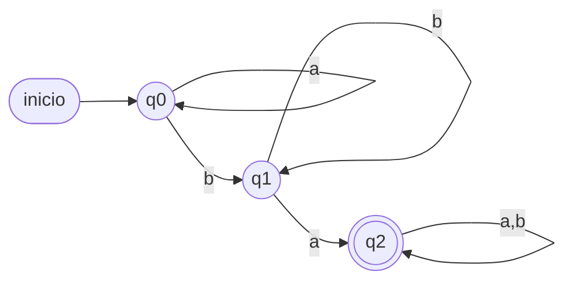
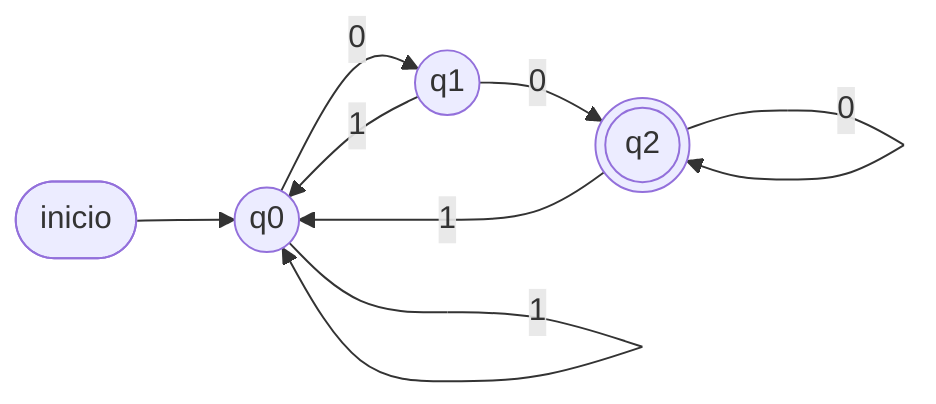
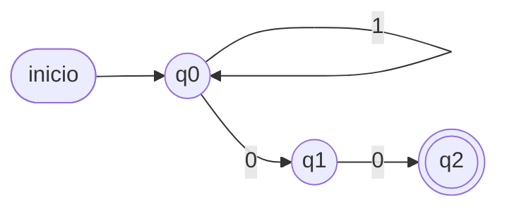
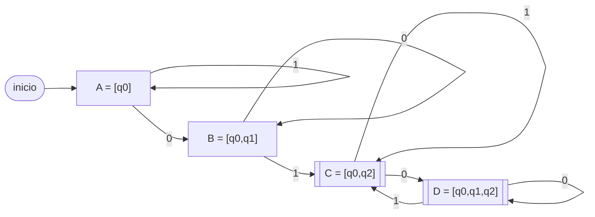
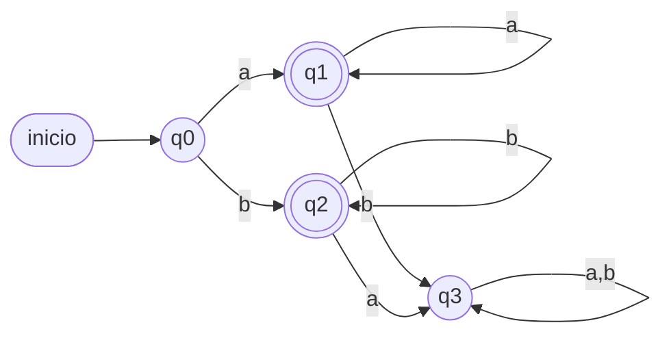
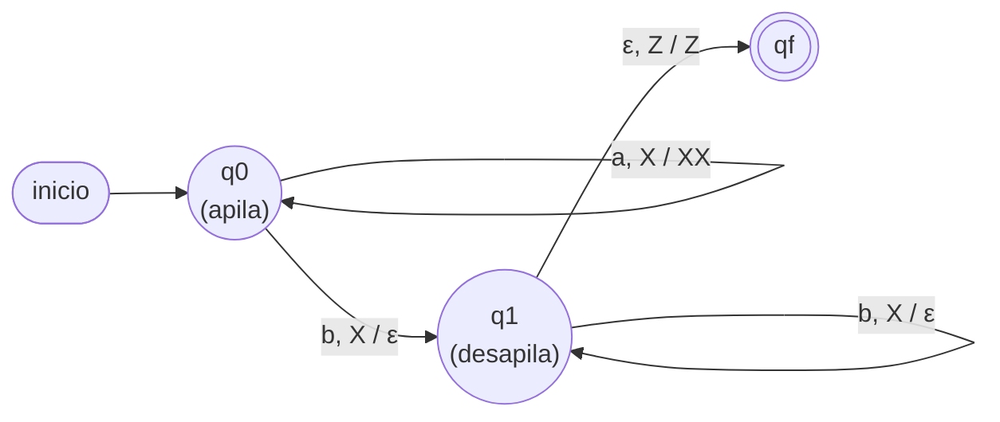

# Pauta de corrección — Control Formativo

Solución de referencia para cada ítem.

---

## Ítem 1 — Gramáticas

`G = ({a,b}, {S,A}, {S → aS | bA, A → bA | b}, S)`.

a) `S → bA → bb`  ·  `S → aS → abA → abb`.
b) Estructura: `aⁿ` (por `S→aS`), luego una `b` (por `S→bA`), luego `bᵏ` (por
   `A→bA`) y una `b` final (`A→b`). El bloque de `b` tiene **al menos 2**:
   ```
   L(G) = {aⁿ bᵐ / n ≥ 0, m ≥ 2}
   ```

---

## Ítem 2 — GRE → GR

- `S → abS` (dos terminales) → `S → aX₁`, `X₁ → bS`.
- `S → cA`  → **ya regular**.
- `S → ε`   → **ya regular**.
- `A → aab` (tres terminales) → `A → aY₁`, `Y₁ → aY₂`, `Y₂ → b`.
- `A → c`   → **ya regular**.

GR equivalente:
```
S  → aX₁ | cA | ε
X₁ → bS
A  → aY₁ | c
Y₁ → aY₂
Y₂ → b
```

---

## Ítem 3 — AFD contiene `ba`

`Q = {q0,q1,q2}`, `q0` inicial, `F = {q2}`.

| δ | a | b |
|---|---|---|
| → q0 | q0 | q1 |
| q1 | q2 | q1 |
| * q2 | q2 | q2 |

q0 = sin `b` reciente; q1 = última leída `b`; q2 = ya vi `ba` (absorbe).
Verif. `ba`: q0→q1→q2 ✓; `ab`: q0→q0→q1 ✗.



---

## Ítem 4 — Termina en `00`

**(a) AFD** `F = {q2}`:

| δ | 0 | 1 |
|---|---|---|
| → q0 | q1 | q0 |
| q1 | q2 | q0 |
| * q2 | q2 | q0 |

Diagrama AFD:



**(b) AFND** `F = {q2}`:
```
δ(q0,0) = {q0,q1}   δ(q0,1) = {q0}
δ(q1,0) = {q2}      δ(q1,1) = ∅
(q2 sin transiciones de salida)
```



**(c) Trazas:**
`1000`: `{q0}→{q0}→{q0,q1}→{q0,q1,q2}→{q0,q1,q2}` ⇒ contiene q2 ⇒ **ACEPTA** ✓.
`1001`: `{q0}→{q0}→{q0,q1}→{q0,q1,q2}→{q0}` (con el `1` final) ⇒ sin q2 ⇒ **RECHAZA** ✓.

---

## Ítem 5 — Subconjuntos

Desde `[q0]`:

| δ_D | 0 | 1 |
|---|---|---|
| → A = [q0] | B | A |
| B = [q0,q1] | B | C |
| * C = [q0,q2] | D | C |
| * D = [q0,q1,q2] | D | C |

Finales `{C, D}` (contienen q2). Todos alcanzables ⇒ no hay inalcanzables.



---

## Ítem 6 — Minimización

`Π₀ = { q0 q3 | q1 q2 }` (no finales | finales).

- Grupo `{q0,q3}`: `q0` con `a`→q1(F) y con `b`→q2(F); `q3` con `a,b`→q3(NF).
  Van a grupos distintos ⇒ se separan: `{q0}`, `{q3}`.
- Grupo `{q1,q2}`: `q1` con `a`→q1(F), `b`→q3(NF); `q2` con `a`→q3(NF), `b`→q2(F).
  Con `a` van a grupos distintos ⇒ se separan: `{q1}`, `{q2}`.

`Π₁ = { q0 | q1 | q2 | q3 }` y `Π₂ = Π₁`.

**Conclusión:** el AFD **ya es mínimo** (los 4 estados son distinguibles, no se
fusiona ninguno).



---

## Ítem 7 — Autómata apilador `aⁿbⁿ`

`Γ = {X, Z}`:

| Γ \ input | a | b |
|---|---|---|
| **Z** | q0 \ push(X) | q_fail |
| **X** | q0 \ push(X) | q1 \ pop() |

En `q1` cada `b` hace `pop()`. **Criterio de aceptación:** al terminar la entrada
la pila queda vacía (solo `Z`), es decir se apiló una `X` por cada `a` y se
desapiló una por cada `b` ⇒ igual número de `a` y `b`, con `n > 0`.



---

## Ítem 8 — MT `n + m`

Entrada `||+|||` (2 + 3):
```
q0: avanza a la derecha sobre '|'; al leer '+', lo reemplaza por '|' y va a q1
q1: avanza a la derecha sobre '|'; al leer B (blanco), retrocede y va a q2
q2: reemplaza la última '|' por B (borra una marca) → HALT
```
Reemplazar `+` por `|` produce `n+m+1` marcas; borrar una deja `n+m`.
Resultado: `|||||` = 5 = 2 + 3. ✓

---

## Ítem 9 — RegEx

a) `L(b(a+b)*a)` = palabras que **empiezan con `b`** y **terminan con `a`**
   (con cualquier cosa en medio): `{ω ∈ {a,b}* / ω empieza en b y termina en a}`
   (palabra mínima `ba`).
b) "Al menos dos `a`": `(a + b)* a (a + b)* a (a + b)*`.
