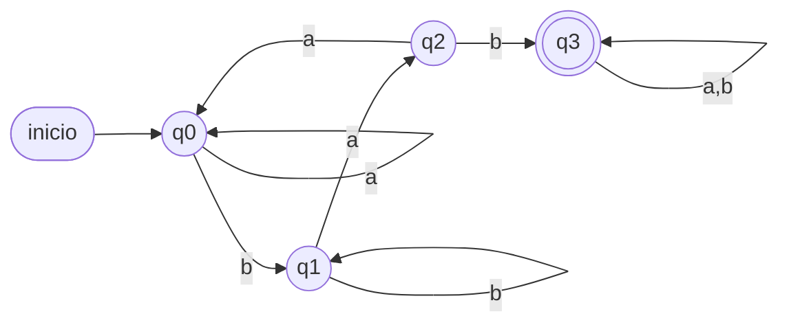
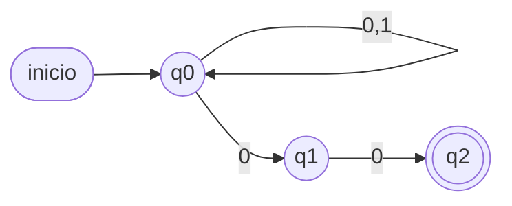
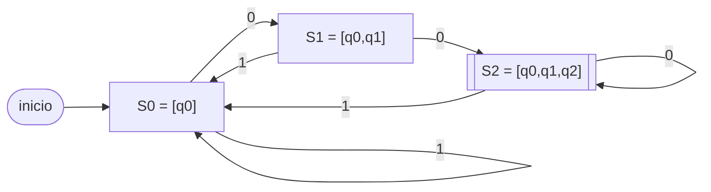
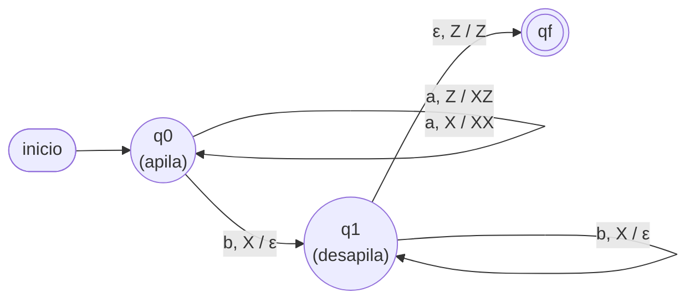
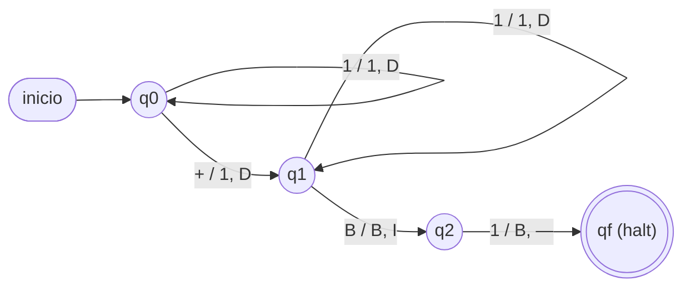

# Pauta de corrección — Control Formativo

Solución de referencia para cada ítem (alineados con los 6 temas de la Prueba 3:
AFD, AFND, AFND-ε, Autómata de Pila, MT 1 cinta, MT multicinta).

---

## Ítem 1 — AFD (contiene `bab` + minimización)

**AFD que contiene la subcadena `bab`.** `Q = {q0,q1,q2,q3}`, `q0` inicial,
`F = {q3}` (absorbente):

| δ | a | b |
|---|---|---|
| → q0 | q0 | q1 |
| q1 | q2 | q1 |
| q2 | q0 | q3 |
| * q3 | q3 | q3 |

q0 = sin progreso; q1 = vi `b`; q2 = vi `ba`; q3 = ya vi `bab` (absorbe).
Verif. `bab`: q0→q1→q2→q3 ✓. `abab`: q0→q0→q1→q2→q3 ✓. `abba`: q0→q0→q1→q1→q0 ✗.



**Minimización del AFD dado** (`F = {q1,q2}`):

`Π₀ = { q0 q3 | q1 q2 }` (no finales | finales).

- Grupo `{q0,q3}`: `q0` con `a`→q1(F), `b`→q2(F); `q3` con `a,b`→q3(NF). Van a
  grupos distintos ⇒ se separan: `{q0}`, `{q3}`.
- Grupo `{q1,q2}`: `q1` con `a`→q1(F), `b`→q3(NF); `q2` con `a`→q3(NF), `b`→q2(F).
  Con `a` van a grupos distintos ⇒ se separan: `{q1}`, `{q2}`.

`Π₁ = { q0 | q1 | q2 | q3 }` y `Π₂ = Π₁` (estable). **El AFD ya es mínimo** (los
4 estados son distinguibles, no se fusiona ninguno).

---

## Ítem 2 — AFND (termina en `00`, diseño directo + subconjuntos)

**AFND directo** (`F = {q2}`, sin transiciones de salida desde `q2`):

```
δ(q0,0) = {q0,q1}   δ(q0,1) = {q0}
δ(q1,0) = {q2}      δ(q1,1) = ∅
```



**Conversión a AFD** (subconjuntos desde `[q0]`):

- `S0=[q0]`: 0→`{q0,q1}`=S1; 1→`{q0}`=S0
- `S1=[q0,q1]`: 0→`{q0,q1}∪{q2}`=`{q0,q1,q2}`=S2; 1→`{q0}`=S0
- `S2=[q0,q1,q2]` (final): 0→`{q0,q1,q2}`=S2 (q2 no aporta nada); 1→`{q0}`=S0

| δ_D | 0 | 1 |
|---|---|---|
| → S0=[q0] | S1 | S0 |
| S1=[q0,q1] | S2 | S0 |
| * S2=[q0,q1,q2] | S2 | S0 |

Verif. `100`: S0→S0(1)→S1(0)→S2(0) ∈F ✓. `1001`: S0→S0→S1→S2→S0(1) ∉F ✓ rechaza.



---

## Ítem 3 — AFND-ε

**a) ε-clausuras:** `εcl(q0) = {q0,q1}` (q0 más lo alcanzable por ε), `εcl(q1) = {q1}`,
`εcl(q2) = {q1,q2}` (q2 alcanza q1 por ε).

**b) Construcción de subconjuntos** (inicial `= εcl(q0) = {q0,q1} = S0`):

- `S0 = {q0,q1}`: con `a` → mueve a `{q0}`, εcl → `{q0,q1} = S0`.
  Con `b` → mueve a `{q2}`, εcl → `{q1,q2} = S1`.
- `S1 = {q1,q2}` (**final**, contiene q2): con `a` → `∅`. Con `b` → `{q2}`, εcl → `S1`.

| δ_D | a | b |
|---|---|---|
| → S0 = {q0,q1} | S0 | S1 |
| * S1 = {q1,q2} | ∅ | S1 |

Lenguaje resultante: `L = a* b⁺` (cualquier cantidad de `a`, luego al menos una `b`).

---

## Ítem 4 — Autómata de Pila `aⁿbⁿ`

`Γ = {X, Z}`:

| Γ \ input | a | b |
|---|---|---|
| **Z** | q0 \ push(X) | q_fail |
| **X** | q0 \ push(X) | q1 \ pop() |

En `q1` cada `b` hace `pop()`. **Criterio de aceptación:** al terminar la entrada
la pila queda vacía (solo `Z`) — se apiló una `X` por cada `a` y se desapiló una
por cada `b` ⇒ igual número de `a` y `b`, con `n > 0`.



**Traza `aabb`** (n=2): `a`⇒`XZ`; `a`⇒`XXZ`; `b`⇒pop→`XZ`(pasa a q1); `b`⇒pop→`Z`;
fin de entrada con pila `Z` ⇒ **ACEPTA** ✓.

---

## Ítem 5 — MT `n + m` (1 cinta)

Entrada `||+|||` (2 + 3):
```
q0: avanza a la derecha sobre '|'; al leer '+', lo reemplaza por '|' y va a q1
q1: avanza a la derecha sobre '|'; al leer B (blanco), retrocede y va a q2
q2: reemplaza la última '|' por B (borra una marca) → HALT
```
Reemplazar `+` por `|` produce `n+m+1` marcas; borrar una deja `n+m`.
Resultado: `|||||` = 5 = 2 + 3. ✓



---

## Ítem 6 — MT multicinta: ¿`n = m`?

Cinta 1 con `n` marcas, cinta 2 con `m` marcas, cabezales al inicio de cada bloque:

```
q0: mientras ambas cintas tengan marca en la posición actual,
    avanzar los dos cabezales a la vez (permanece en q0).
  - si una cinta tiene marca y la otra blanco (no coinciden) → RECHAZAR
  - si ambas cintas quedan en blanco en el mismo paso → ACEPTAR
```

Es la versión multicinta del "comparar de a pares" que en una sola cinta requiere
marcar y tachar símbolos (como en la resta acotada o en `aⁿbⁿcⁿ` del Módulo 4):
con dos cabezales independientes se lee **en paralelo**, sin necesidad de ir y
volver ni de símbolos auxiliares.

**Trazas:** `n=2,m=2` → los cabezales avanzan 2 pasos y ambas cintas llegan a
blanco a la vez ⇒ **ACEPTA**. `n=2,m=3` → al tercer paso la cinta 1 está en
blanco pero la cinta 2 aún tiene marca ⇒ **RECHAZA**.
