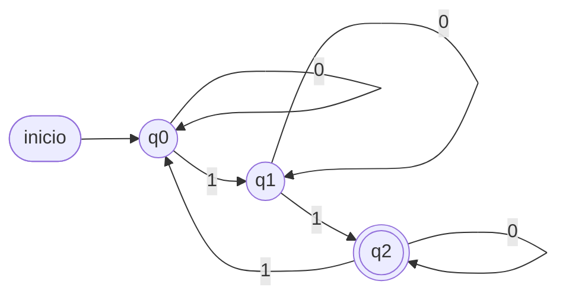
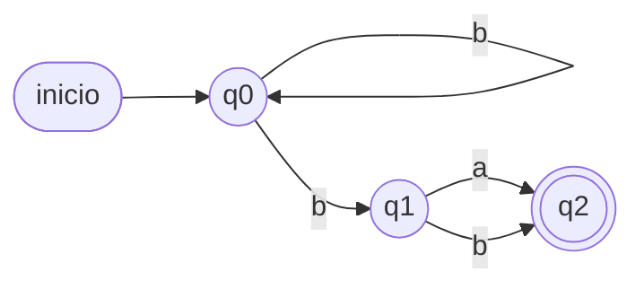
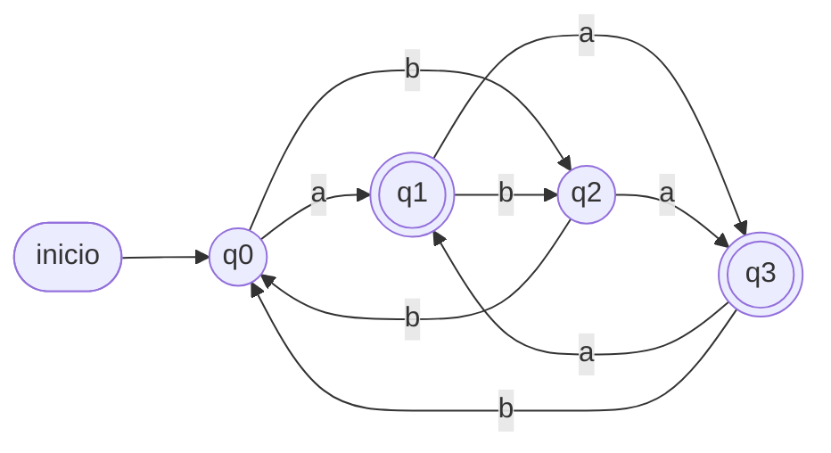
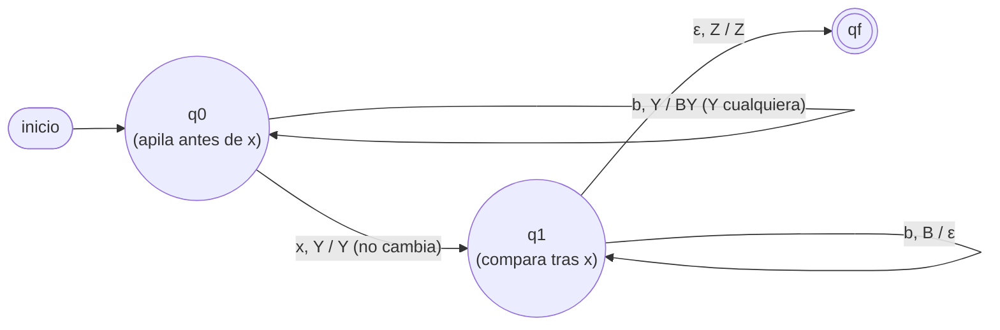
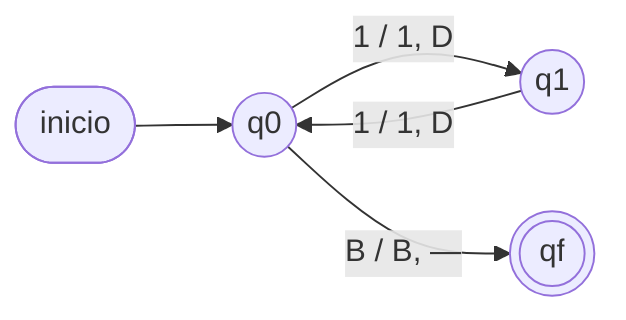

# Ejercicios por tipo — Teoría de Autómatas

Ejercicios agrupados por **tipo de habilidad**. Intenta resolverlos sin mirar
`soluciones-ejercicios.md`.

**Leyenda:**
🟢 básico · 🟡 intermedio · 🔴 avanzado · 📊 *se entrega un diagrama y se pide
leerlo/formalizarlo* (en vez de diseñar desde cero — así se presentan muchos
autómatas en un examen real).

> **Alcance de la Prueba 3.** Según lo informado por el profesor, la 3ª prueba
> cubre **todo lo visto entre la 2ª prueba y el fin del semestre**: **AFD, AFND,
> AFND-ε, Autómatas de Pila, Máquinas de Turing (1 cinta) y Máquinas de Turing
> (multicinta)** — es decir, los **Tipos C a J** de este documento.
> Los **Tipos A, B e I** (gramáticas, GRE→GR y expresiones regulares — Módulos 1
> y 5) son **material complementario** y **no entran en la Prueba 3**; consérvalos
> solo como cultura general de la unidad.

---

## Tipo A — Lenguajes y gramáticas *(complementario, no evaluado en Prueba 3)*

**A1 🟢** Dado `Σ = {a, b}`, lista 5 palabras de
`L = {ω / ω = aⁿb, n ≥ 0}` y descríbelo en palabras.

**A2 🟢** Escribe una gramática regular (GR) para
`L = {ω ∈ {a,b}* / ω = abⁿa, n ≥ 0}`.

**A3 🟡** Da la gramática (GLC o GR según corresponda) y el árbol de derivación de
`abba` para `L = {ω / ω tiene cantidad par de a's y par de b's}`.

**A4 🟡** Determina el lenguaje generado por
`G = ({a,b}, {S,A}, {S → aS | aA | a, A → bS}, S)`.

---

## Tipo B — Transformación GRE → GR (algoritmo de clase) *(complementario)*

**B1 🟡** Transforma a GR equivalente:
`A → abA | ba | ε`.

**B2 🔴** Encuentra una GR equivalente aplicando el algoritmo visto en clases:

```
G₁ = ({a,b,c}, {S,A,B,C},
      {S → aS | aA | aB | ε,
       A → bB | cC | aS | ε,
       B → aB | bC | cA | ε,
       C → a | b | c | ε}, S)
```

*(¿Cuáles producciones ya son regulares y cuáles hay que descomponer?)*

---

## Tipo C — Diseño de AFD

> Habilidad evaluada: construir `M = (Q, Σ, δ, q0, F)` para un lenguaje dado
> (C1–C3), y la habilidad **inversa** — leer un diagrama ya construido y
> extraer su formalización (C4).

**C1 🟢** Diseña un AFD sobre `{a, b}` que acepte las palabras que **terminan en
`ab`**.
**Se pide:** quíntupla formal, tabla de transición y diagrama de estados.

**C2 🟡** Diseña un AFD sobre `{a, b}` que acepte
`L = {ω / #a impar y #b par}` (producto cartesiano de paridades).
**Se pide:** quíntupla, tabla y diagrama.

**C3 🔴** Sea `Σ = {0, 1}`. Diseña el **AFD mínimo** que acepte las palabras donde
el número de `0`s es **par** Y el número de `1`s es **impar**.
**Se pide:** quíntupla y una **justificación formal** de por qué necesita
exactamente esa cantidad de estados (¿qué representa cada uno?).

**C4 🟡📊** Considera el siguiente AFD sobre `Σ = {0, 1}`:



**Se pide:**
a) Escribe la quíntupla formal `M = (Q, Σ, δ, q0, F)` y la tabla de transición.
b) Describe `L(M)` **por comprensión** (¿qué propiedad de la cantidad de `1`s
   caracteriza a las palabras aceptadas?).
c) Traza las palabras `101` y `11011` — ¿cuál acepta y cuál rechaza?

---

## Tipo D — AFD vs AFND (mismo lenguaje, dos enfoques)

**D1 🟡** Diseña un autómata sobre `Σ = {a, b}` que acepte las palabras que
contienen la subcadena **`aa`**, de **dos formas**:
(A) como AFD y (B) como AFND.
**Se pide:** para cada uno, la quíntupla formal, la tabla de transición y el
diagrama. Verifica ambos con la palabra `baa`.

**D2 🔴** Para tu solución de D1(B) (AFND), traza el análisis de hilos de las
palabras `aba` (debe rechazar) y `baab` (debe aceptar).

---

## Tipo E — AFND / AFND-ε → AFD (construcción de subconjuntos)

**E1 🟡** Convierte a AFD el siguiente AFND (`F = {q2}`):

```
δ(q0, a) = {q0, q1}    δ(q0, b) = {q0}
δ(q1, a) = {q2}        δ(q1, b) = ∅
δ(q2, a) = {q2}        δ(q2, b) = {q2}
```

**Se pide:** la tabla del AFD, indicando los estados finales y tachando los
inalcanzables.

**E2 🔴** Dado un AFND-ε, explica y aplica cómo se usa la **ε-clausura** en la
construcción de subconjuntos. Usa:

```
δ(q0, ε) = {q1}    δ(q0, a) = {q0}
δ(q1, b) = {q2}    δ(q2, ε) = {q1}
```
con `q0` inicial y `F = {q2}`.
**Se pide:** ε-clausura de cada estado y tabla completa del AFD equivalente.

**E3 🔴📊** Considera el siguiente AFND sobre `Σ = {a, b}` (`F = {q2}`):



**Se pide:**
a) Formaliza `M = (Q, Σ, δ, q0, F)` a partir del diagrama (escribe `δ` en
   conjuntos).
b) Construye el **AFD equivalente** por construcción de subconjuntos: tabla
   completa e indicación de los estados finales.
c) Describe `L(M)` por comprensión (piensa en qué posición, contada desde el
   final, debe estar cada símbolo).
d) Verifica con `ab` (debe rechazar) y `ba` (debe aceptar).

---

## Tipo F — Minimización de AFD

**F1 🔴** Minimiza el AFD (inicial `q0`, `F = {q3,q4,q5,q6,q7,q8}`):

| δ | 0 | 1 |
|---|---|---|
| q0 | q1 | q2 |
| q1 | q3 | q2 |
| q2 | q1 | q4 |
| q3 | q3 | q5 |
| q4 | q6 | q4 |
| q5 | q3 | q7 |
| q6 | q8 | q4 |
| q7 | q8 | q7 |
| q8 | q8 | q7 |

**Se pide:** muestra las particiones `Π₀, Π₁, …` hasta estabilizar, y da el AFD
mínimo resultante (quíntupla + tabla).

**F2 🔴📊** Considera el siguiente AFD sobre `Σ = {a, b}` (`q0` inicial,
`F = {q1, q3}`):



**Se pide:**
a) Extrae del diagrama la tabla de transición formal.
b) Minimiza aplicando el algoritmo de particiones (muestra `Π₀, Π₁, …` hasta
   estabilizar). **Advertencia:** no asumas por simple inspección visual cuáles
   estados se fusionan — dos estados que "se ven distintos" en el diagrama
   pueden ser equivalentes, y viceversa.
c) Dibuja el diagrama del AFD mínimo resultante.
d) Describe `L(M)` por comprensión.

---

## Tipo G — Autómatas de Pila

**G1 🟡** Diseña la tabla de transición de un a.a. que acepte
`L = {aⁿbⁿ / n > 0}`, con `Γ = {X, Z}`.
**Se pide:** quíntupla formal `M = (Q, Σ, Γ, δ, q0, Z, F)` y tabla.

**G2 🔴** Diseña un a.a. que valide `L = {aᵐbⁿ / m = n + 1}`.

**G3 🔴** Diseña un a.a. que valide `L = {aᵐbⁿ / m = 2n}`.

**G4 🔴📊** Considera el siguiente autómata de pila sobre `Σ = {a, b, x}`,
con `Γ = {A, B, Z}` (`Y` en una arista significa "cualquier símbolo del tope"):



**Se pide:**
a) Formaliza `M = (Q, Σ, Γ, δ, q0, Z, F)` a partir del diagrama.
b) Describe `L(M)` por comprensión (¿qué relación hay entre lo que viene antes
   y después de la `x`?).
c) Explica el criterio de aceptación.
d) Traza `abxba` (debe aceptar) y `abxab` (debe rechazar). Justifica por qué
   una de las dos falla exactamente en la comparación.

---

## Tipo H — Máquinas de Turing (1 cinta)

**H1 🔴** Diseña una MT (1 cinta) que calcule `f(n, m) = n + m` en sistema unitario.
Entrada `3 + 4`: `…BBB|||+||||BBB…`.
**Se pide:** quíntupla `M = (Q, Σ, Γ, δ, q0, B, F)` y descripción de estados y
movimientos.

**H2 🟡** Diseña una MT (1 cinta) que calcule el **predecesor** `f(n) = n − 1`
(para `n > 0`) en sistema unitario. Entrada `||||` (4) → salida `|||` (3).

**H3 🔴** Describe (a nivel de estados y reglas) una MT (1 cinta) **reconocedora**
de `L = {aⁿbⁿcⁿ / n ≥ 1}`. Explica por qué un autómata de pila (Tipo G) **no**
puede reconocer este lenguaje.

**H4 🟡📊** Considera la siguiente MT (1 cinta) sobre `Σ = {1}` (sistema unitario),
con `qf` como único estado de aceptación:



**Se pide:**
a) Formaliza `M = (Q, Σ, Γ, δ, q0, B, F)` a partir del diagrama (nota: no es
   una MT que *calcule* una función, sino que **reconoce** un lenguaje — ¿en
   qué estados se detiene sin llegar a `qf`?).
b) Describe `L(M)` por comprensión (¿qué propiedad de `n` reconoce?).
c) Traza (con configuraciones `αqβ` si quieres, o describiendo los pasos) las
   entradas `||||` (n=4) y `|||` (n=3). ¿Cuál acepta y cuál no se detiene en `qf`?

---

## Tipo J — Máquinas de Turing (multicinta)

**J1 🔴** Describe la estrategia de una MT **multicinta** (2 cintas) que calcule
`f(n, m) = n · m` en sistema unitario. Entrada `4 * 3`: `…BBB||||*|||BBB…`.
**Se pide:** qué contiene cada cinta y qué hace cada "ronda" del cómputo.

**J2 🟡** Describe una MT **multicinta** (2 cintas) que calcule
`f(n, m) = máx(n, m)` en sistema unitario, escribiendo el resultado en una
tercera cinta. ¿Por qué es más simple con varias cintas que con una sola?

---

## Tipo I — Expresiones regulares *(complementario, no evaluado en Prueba 3)*

**I1 🟢** Da 5 palabras y describe por comprensión `L((a + b)* ab)`.

**I2 🟡** Escribe una RegEx para "palabras sobre `{0,1}` que **terminan en `01`**".

**I3 🟡** Traduce a lenguaje (por comprensión) `(a* + b*)*` sobre `{a, b}`.

**I4 🔴** Construye el AFND-ε de Thompson para la RegEx `a(a + b)*`.
