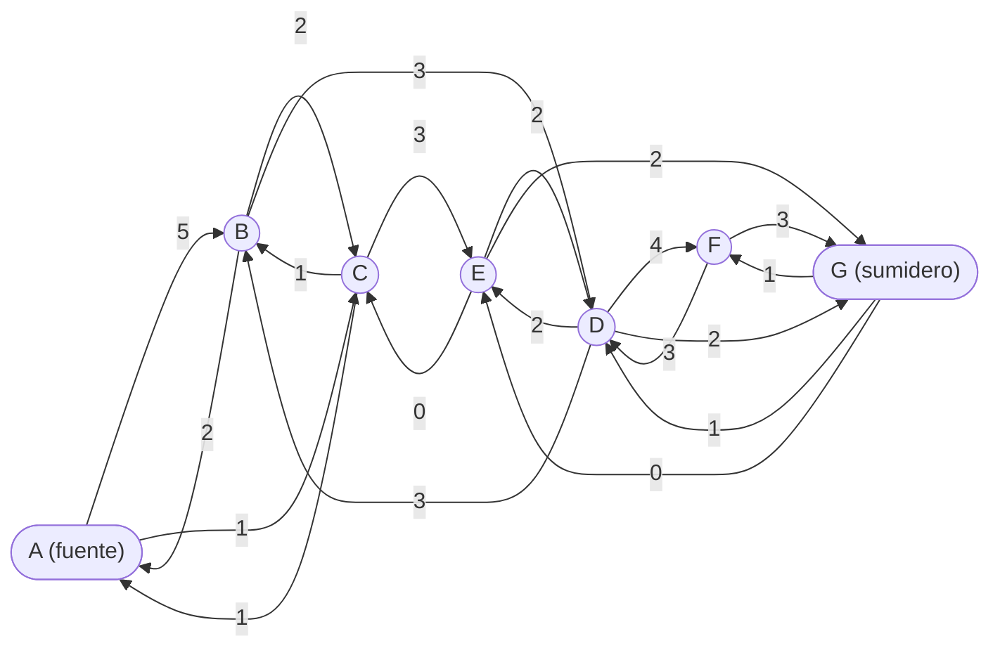

# Ejercicios propuestos oficiales — Prueba 1 (Unidad 2: Grafos)

> Transcripción de `Ejercicios_P1.pdf` (UTEM, profesores Cáceres, Corbinaud,
> Cristi, Herrera). Los ejercicios 1–12 son de **alternativas**; 13–15 de
> desarrollo. ⚠️ Varios dependen de **figuras** del PDF original (se indican);
> los que dependen solo de matrices o fórmulas se pueden resolver desde aquí.
> Módulos de apoyo: `material-estudio/unidad-2-grafos/`.

## Alternativas

**1.** *(figura)* Dado el dígrafo etiquetado, ¿cuál es la distancia entre `x` e
`y`? — A) ∞ · B) 5 · C) 12

**2.** Dadas las matrices de adyacencia A, B y C de tres grafos (4×4):

```
    ⎛0 0 1 0⎞      ⎛0 1 1 1⎞      ⎛0 1 1 1⎞
A = ⎜1 1 0 1⎟  B = ⎜1 0 0 0⎟  C = ⎜1 0 1 1⎟
    ⎜0 1 0 1⎟      ⎜1 0 0 1⎟      ⎜1 1 0 1⎟
    ⎝0 1 1 0⎠      ⎝1 0 1 0⎠      ⎝1 1 1 0⎠
```
A) A y B son isomorfos · B) A y C son isomorfos · C) B y C son isomorfos
*(Pista: compara primero las sumas por fila = valencias.)*

**3.** *(figura)* ¿Cuál de los grafos NO se puede dibujar sin levantar el lápiz
y sin repetir aristas? *(= ¿cuál no tiene camino euleriano?)*

**4.** Dado un grafo con matriz de adyacencia (5×5):
```
⎛0 1 1 0 1⎞
⎜1 0 1 0 1⎟
⎜1 1 0 1 0⎟
⎜0 0 1 0 1⎟
⎝1 1 0 1 0⎠
```
A) El grafo es euleriano · B) El grafo es conexo · C) Es un multígrafo

**5.** Sea `M` la matriz de adyacencia de un grafo con `p > 1` vértices y
`C = Mᵖ + Mᵖ⁻¹ + … + M`:
A) Si C≠0 entonces el grafo es conexo ·
B) Si `C[i][j] = 1` entonces existe una arista entre i y j ·
C) Si el grafo es conexo entonces todas las entradas de C son no nulas.

**6.** Sea G un grafo donde **todos** los vértices tienen grado 4 y hay
14 aristas, y M un mapa con `#R` regiones que representa a G:
A) #R = 9 · B) #R = 12 · C) #R = 10
*(Pista: suma de grados = 2m ⇒ n = 7; fórmula de Euler n − m + #R = 2.)*

**7.** Dos grafos con secuencias de grados `2,3,4,4,3,2` y `2,4,4,2,4,2`:
A) Son isomorfos pues tienen igual número de vértices y aristas ·
B) Son isomorfos porque existe un isomorfismo ·
C) **No** son isomorfos pues difieren en la cantidad de vértices de grado 2.

**8.** *(figura)* Sea el mapa M: A) se puede colorear con 3 colores ·
B) necesita más de 3 · C) necesita más de 4.

**9.** Dado G con matriz de adyacencia (5×5):
```
⎛0 1 1 0 1⎞
⎜1 0 1 0 0⎟
⎜1 1 0 1 1⎟
⎜0 0 1 0 1⎟
⎝1 0 1 1 0⎠
```
A) G tiene un camino euleriano · B) G no es conexo · C) G tiene un vértice de grado 5
*(Pista: cuenta los vértices de grado impar — camino euleriano ⟺ 0 o 2 impares.)*

**10.** *(figura)* Los grafos de la figura, ¿son isomorfos?

**11.** *(figura)* Con `L(vᵢ)` = largo del camino más corto entre `u` y `vᵢ`:
A) L(v4)=6 y L(v2)=2 · B) L(v3)=4 y L(v4)=6 · C) L(v3)=3 y L(v4)=5

**12.** *(figura)* ¿Cuántas veces se debe levantar el lápiz para dibujar la
figura sin repetir aristas? — A) Ninguna · B) Una · C) Dos

## Desarrollo

**13.** Demuestra que `Fv = 5:5:4:4:3:3:3:3:1` corresponde a un grafo, usando
el **algoritmo sobre valencias**; dibújalo. ¿Es plano? Si lo es, dibújalo plano.

**14.** *(figura: red de 9 sitios a–i con costos)* Para la red de computadores:
a) Genera la **matriz de costos** de la red.
b) Determina por medio de un algoritmo la cantidad de **caminos de largo k**
   del sitio "a" al sitio "e".
c) Determina un árbol por **anchura** y otro por **profundidad**.
d) Escribe un algoritmo que determine la cantidad **mínima de metros de cable**
   para conectar todos los puntos de la red *(= AEM: Prim/Kruskal)*.
e) Determina el **número cromático** del grafo.
f) Establece un camino y un ciclo **euleriano**, y otro **hamiltoniano**, si existen.

**15.** Determina el **flujo máximo** para trasladar petróleo desde el estanque
"A" al estanque "G", según la matriz de capacidades origen→destino:

| O\D | A | B | C | D | E | F | G |
|---|---|---|---|---|---|---|---|
| **A** | — | 5 | 1 | — | — | — | — |
| **B** | 2 | — | 2 | 3 | — | — | — |
| **C** | 1 | 1 | — | — | 3 | — | — |
| **D** | — | 3 | — | — | 2 | 4 | 2 |
| **E** | — | — | 0 | 2 | — | — | 2 |
| **F** | — | — | — | 3 | — | — | 3 |
| **G** | — | — | — | 1 | 0 | 1 | — |

*(Técnica: Ford-Fulkerson — módulo `04-grafos-ponderados.md`.)*

Red de flujo (cada arista muestra su **capacidad**; fuente = A, sumidero = G):


