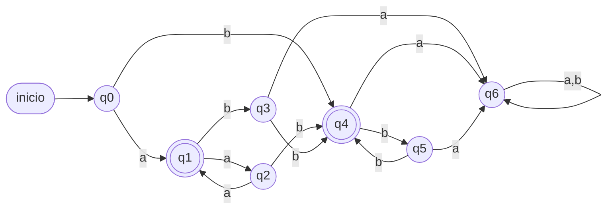
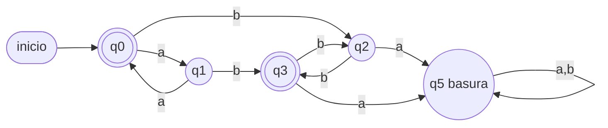
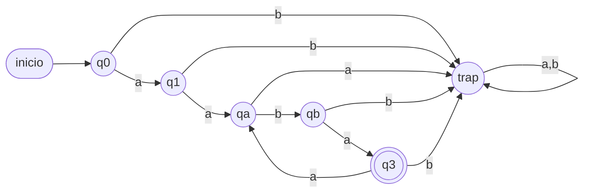
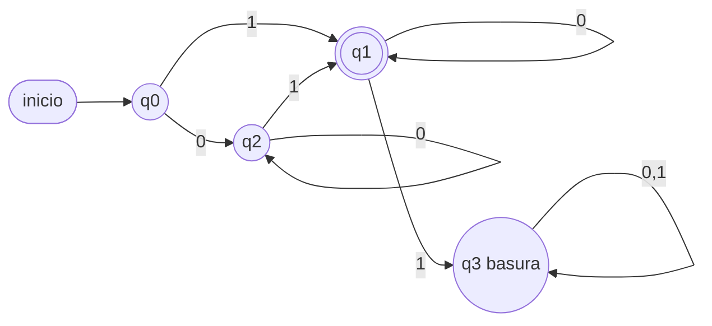
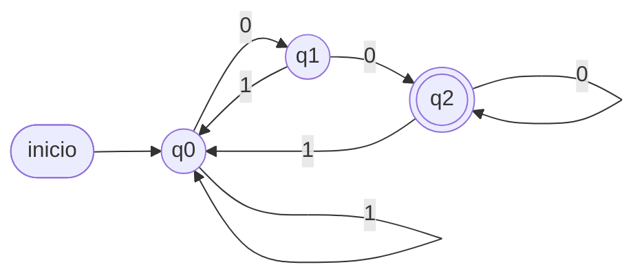

# Controles oficiales con pauta — AFD y GR (Unidad 3)

> Transcripción de los controles oficiales del ramo (prof. R. Corbinaud):
> **Control 3** (08/06/2024) y **Control 4** (secciones 412 y 413). Todos piden
> lo mismo — el **tipo de ejercicio estándar de control**:
>
> a) Un **AFD** que reconozca el lenguaje, definiendo **todos** sus parámetros:
>    `AFD = {Σ, Q, δ, q0, F}` (tabla de transiciones + diagrama).
> b) Una **Gramática Regular** que genere el lenguaje, definiendo
>    `GR = {Σ, N, S, P}` (solo Control 3).
>
> Las tablas de las pautas fueron **verificadas computacionalmente**; donde la
> pauta extraída presenta inconsistencias, se indica y se entrega una versión
> verificada.

---

## Los lenguajes que se evalúan

| Control | Lenguaje |
|---|---|
| C3-2024 y C4-412 | `L = {aⁿbᵐ / n,m ≥ 0; m+n es IMPAR}` |
| C4-413 | `L = {aⁿbᵐ / n,m ≥ 0; m+n es PAR}` |
| C3-2024 | `L = {a(aba)ⁿ / n > 0}` |
| C3-2024 y C4-412 | `L = {w ∈ {0,1}* / w es un byte que representa una potencia de 2}` |
| C4-413 | `L = {w ∈ {0,1}* / w representa un binario múltiplo de 4}` |

---

## Pauta 1 — `L = {aⁿbᵐ / m+n impar}` (C4-412, verificada ✓)

`L = {a, b, bbb, abb, aab, aaabb, …}` (todas las `a` antes que las `b`, largo
total impar).

`Σ = {a,b}`, `Q = {q0,…,q6}`, `q0` inicial, `F = {q1, q4}`:

| δ | a | b |
|---|---|---|
| → q0 | q1 | q4 |
| * q1 | q2 | q3 |
| q2 | q1 | q4 |
| q3 | q6 | q4 |
| * q4 | q6 | q5 |
| q5 | q6 | q4 |
| q6 | q6 | q6 |

Lectura: `q1/q2` = fase de `a` con total impar/par; `q3/q5` = fase de `b` con
total par; `q4` = fase de `b` con total impar (final); `q6` = basura (una `a`
después de una `b`). **Verificada contra todas las palabras de largo ≤ 7 ✓.**



**GR equivalente (versión propia, mismo lenguaje):**
```
S → aP | b | bQ        P → aS | b | bQ        Q → bR        R → b | bQ
```
donde `S` genera desde fase-a con 0 letras (par), `P` fase-a impar, `Q/R`
alternan paridad en la fase-b. (Chequea derivando `a`, `abb`, `bbb`.)

---

## Pauta 2 — `L = {aⁿbᵐ / m+n par}` (C4-413, ⚠️ con corrección)

⚠️ **Advertencia:** la tabla de la pauta original (5 estados,
`F = {q0, q4}`) **falla al verificarla** — rechaza `ab` y `bb` (que están en
L) — probablemente por un error de transcripción del documento. Versión
**verificada** (5 estados + basura):

| δ | a | b | comentario |
|---|---|---|---|
| → * q0 | q1 | q2 | fase a, total par (acepta ε) |
| q1 | q0 | q3 | fase a, total impar |
| q2 | q5 | q3 | fase b, total impar |
| * q3 | q5 | q2 | fase b, total par |
| q5 | q5 | q5 | basura (a tras b) |

`F = {q0, q3}`. Verif.: `ε` ✓, `aa` ✓ (q1→q0), `ab` ✓ (q1→q3), `bb` ✓
(q2→q3), `b` ✗ (q2), `ba` ✗ (q2→q5 basura).



---

## Pauta 3 — `L = {a(aba)ⁿ / n > 0}` (C3-2024)

Truco de la pauta: sustituir `U = aba` ⇒ `L = {aUⁿ / n > 0}`. Con
`Σ' = {a, U}`: `Q = {q0,q1,q2,q3}`, `q0` inicial, `F = {q3}`:

| δ | a | U |
|---|---|---|
| → q0 | q1 | q2 |
| q1 | q2 | q3 |
| q2 | q2 | q2 |
| * q3 | q2 | q3 |

(Al expandir `U` de vuelta a `aba`, cada transición con `U` se convierte en la
cadena de 3 transiciones `a·b·a` con estados intermedios.)
⚠️ Nota: el enunciado dice `a(aba)ⁿ` pero la solución de la pauta desarrolla
`a(bab)ⁿ`/`a(baba)ⁿ` en algunos pasos — al estudiar, fija tú la versión del
lenguaje y sé consistente.

**AFD expandido sobre `{a,b}`** (expandiendo `U=aba` en 3 transiciones con
estados intermedios `qa` y `qb`):
`Q = {q0, q1, qa, qb, q3, trap}`, `q0` inicial, `F = {q3}`:



Lectura de estados: `q0`=inicio; `q1`=leída la `a` inicial; `qa`=leída la
primera `a` de un grupo `aba`; `qb`=leído `ab` del grupo; `q3`=completado al
menos un `aba` (FINAL); `trap`=error.
Verif.: `aaba` → q0→q1→qa→qb→q3 ✓; `aabaaba` → …→q3→qa→qb→q3 ✓; `aba` →
q0→q1→trap (recha: `aba` ≠ a·(aba)^n) ✓.

---

## Pauta 4 — `L = {byte potencia de 2}` (C3-2024 y C4-412, verificada ✓)

`L = {00000001, 00000010, …, 10000000}` — binarios con **exactamente un `1`**.

`Σ = {0,1}`, `Q = {q0,q1,q2,q3}`, `q0` inicial, `F = {q1}`:

| δ | 0 | 1 |
|---|---|---|
| → q0 | q2 | q1 |
| * q1 | q1 | q3 |
| q2 | q2 | q1 |
| q3 | q3 | q3 |

Lectura: `q2` = solo ceros vistos; `q1` = exactamente un 1 visto (final);
`q3` = basura (segundo 1). **Verificada ✓.**
⚠️ Nota fina: esta pauta acepta cualquier largo con un único `1` (no fuerza
los 8 bits exactos de un "byte"); para forzar largo 8 harían falta contadores
de posición (8×3 estados aprox.).



---

## Pauta 5 — `L = {binario múltiplo de 4}` (C4-413, verificada ✓)

Un binario es múltiplo de 4 ⟺ **termina en `00`**.

`Σ = {0,1}`, `Q = {q0,q1,q2}`, `q0` inicial, `F = {q2}`:

| δ | 0 | 1 |
|---|---|---|
| → q0 | q1 | q0 |
| q1 | q2 | q0 |
| * q2 | q2 | q0 |

Lectura: `q1` = el último fue `0`; `q2` = los dos últimos fueron `00` (final).
**Verificada ✓** (borde: la palabra `0` = número cero queda fuera).



---

## Cómo entrenarse con esto

1. Tapa las pautas, resuelve cada lenguaje (AFD completo con Σ, Q, δ, q0, F).
2. Compara contra la tabla y **traza 3 palabras** (2 que acepten, 1 que no).
3. Escribe la GR de cada uno (correspondencia estado ↔ no terminal).
4. Fíjate en el patrón común de los controles: lenguajes `aⁿbᵐ` con condición
   de paridad + lenguajes "numéricos" en binario. Son variaciones del
   producto de paridades y de "recordar el sufijo".
