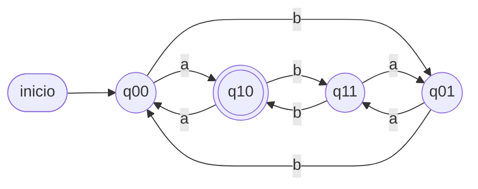
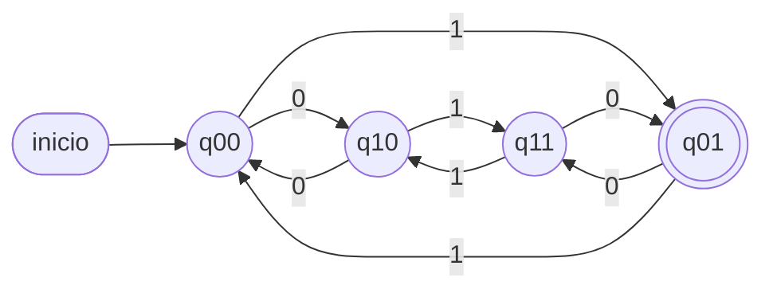
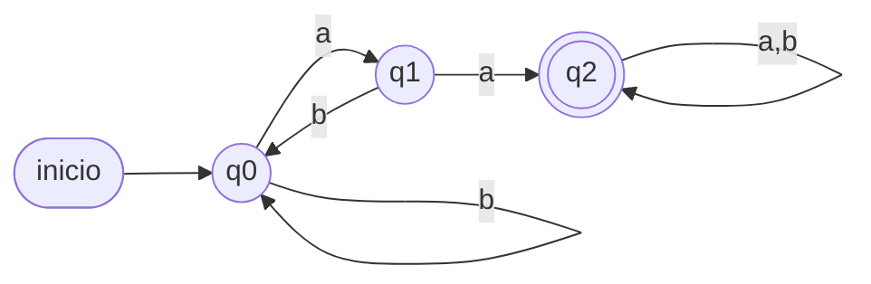
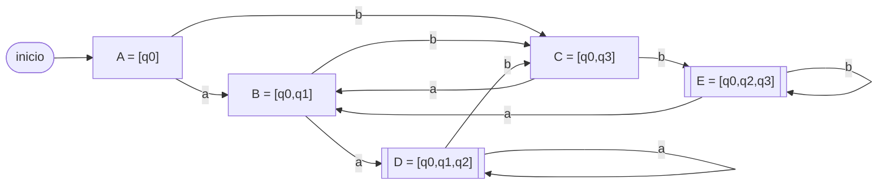
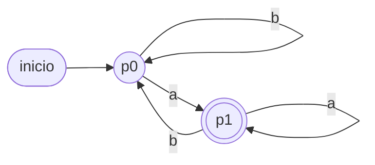
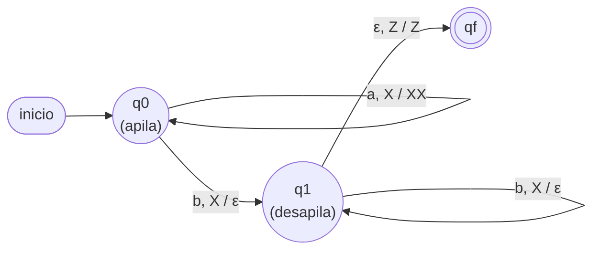
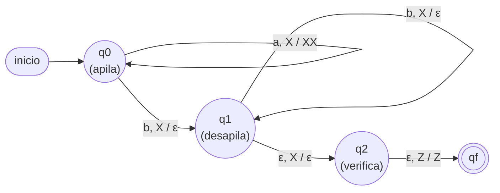
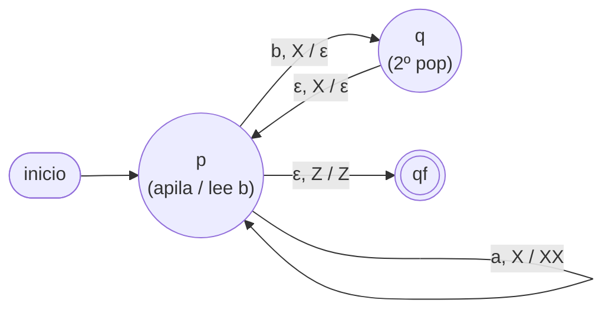
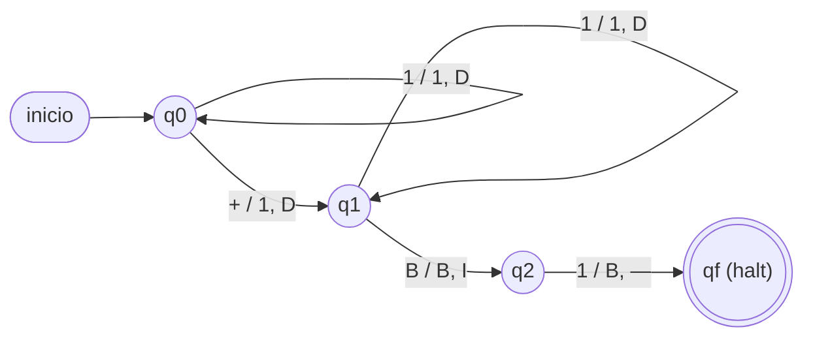
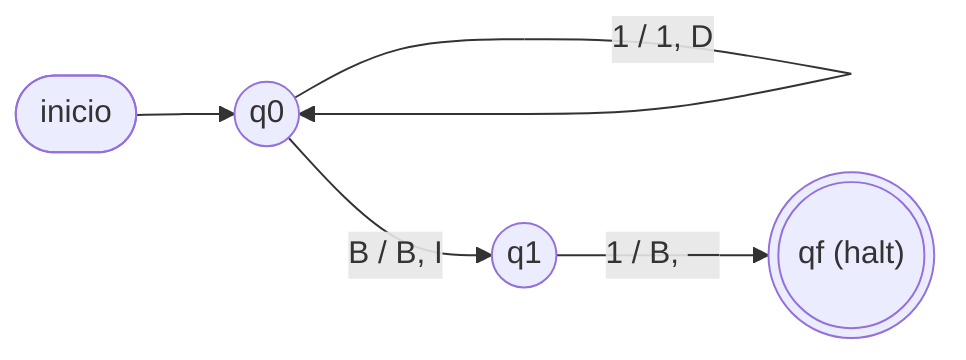

# Soluciones desarrolladas — Ejercicios por tipo

> Intenta resolver por tu cuenta antes de leer. Notación: `M = (Q, Σ, δ, q0, F)`.

---

## Tipo A — Lenguajes y gramáticas *(complementario, no evaluado en Prueba 3)*

**A1.** `L = {aⁿb / n ≥ 0}` → `b, ab, aab, aaab, aaaab`.
Descripción: *cero o más `a`'s seguidas de exactamente una `b`*.

**A2.** `L = {abⁿa / n ≥ 0} = {aa, aba, abba, …}`. GR:

```
S → aA
A → bA | a
```
Verificación: `S→aA→a·a = aa` (n=0); `S→aA→abA→ab·a = aba` (n=1). ✓

**A3.** `L = {ω / #a par y #b par}`. GLC (del apunte, G₃):

```
S → aSa | bSb | aAb | bAa | ε      A → aSb | bSa
```
Árbol de derivación de `abba`:
```
S → aSa → a(bSb)a → a b (ε) b a = abba
```
`S ⇒ aSa ⇒ abSba ⇒ abba` (con `S → ε`). ✓ (2 a's, 2 b's, ambas pares.)

**A4.** `G = ({a,b},{S,A},{S→aS|aA|a, A→bS}, S)`.
`L(G) = {ω ∈ {a,b}* / ω empieza y termina en a, y no tiene dos b's consecutivas}`.
Razonamiento: la única forma de terminar es `S → a` (toda palabra termina en a);
toda derivación de `S` agrega una `a` (toda palabra empieza en a); `A` agrega una
`b` y obliga a volver a `S` (nunca dos b's seguidas).

---

## Tipo B — Transformación GRE → GR

**B1.** `A → abA | ba | ε`. La producción `abA` tiene dos terminales y `ba` también.
Descomponemos con auxiliares:

```
A  → aX₁ | bX₂ | ε
X₁ → bA
X₂ → a
```
Cada producción queda en forma `A → aB`, `A → a` o `A → ε`. ✓

**B2.** **Trampa didáctica.** Revisemos cada producción de `G₁`:

```
S → aS | aA | aB | ε      (todas forma  A→aB  o  A→ε)  ✓ regular
A → bB | cC | aS | ε      (todas forma  A→aB  o  A→ε)  ✓ regular
B → aB | bC | cA | ε      (todas forma  A→aB  o  A→ε)  ✓ regular
C → a  | b  | c  | ε      (todas forma  A→a   o  A→ε)  ✓ regular
```

**Todas las producciones ya están en forma regular** (un terminal, o un terminal
seguido de un solo no terminal, o ε). Por lo tanto `G₁` **ya es una GR**: su GR
equivalente es ella misma; no hay palabras largas que descomponer. El ejercicio
evalúa si reconoces la forma regular y no "inventas" una transformación innecesaria.

> Tipos A y B: material complementario (Módulo 1), **no evaluado en la Prueba 3**.

---

## Tipo C — Diseño de AFD

**C1.** AFD que acepta palabras **que terminan en `ab`**.
`Q = {q0, q1, q2}`, `q0` inicial, `F = {q2}`.

| δ | a | b |
|---|---|---|
| → q0 | q1 | q0 |
| q1 | q1 | q2 |
| * q2 | q1 | q0 |

- q0: aún no hay una `a` "pendiente". q1: última leída es `a`. q2: acabo de leer `ab`.
- Verif.: `ab`: q0→q1→q2 ✓; `abb`: q0→q1→q2→q0 ✗; `aab`: q0→q1→q1→q2 ✓.


**C2.** `L = {#a impar y #b par}`. Estados `(#a mod 2, #b mod 2)`:

| δ | a | b |
|---|---|---|
| → q00 | q10 | q01 |
| * q10 | q00 | q11 |
| q01 | q11 | q00 |
| q11 | q01 | q10 |

`q00` inicial (a par, b par), `F = {q10}` (a impar, b par). Leer `a` cambia la 1ª
paridad; leer `b`, la 2ª.



**C3.** AFD **mínimo** para `#0 par` **y** `#1 impar`. Como las dos condiciones son
independientes, hay `2 × 2 = 4` combinaciones ⇒ **4 estados** (y son todos
distinguibles, así que es mínimo):

- `q00`: 0's par, 1's par — inicial, **no** final.
- `q01`: 0's par, 1's impar — **FINAL** ✓.
- `q10`: 0's impar, 1's par — no final.
- `q11`: 0's impar, 1's impar — no final.

| δ | 0 | 1 |
|---|---|---|
| → q00 | q10 | q01 |
| * q01 | q11 | q00 |
| q10 | q00 | q11 |
| q11 | q01 | q10 |

Verif. `001`: q00→q10→q00→q01 ∈ F ✓. `0011`: q00→q10→q00→q01→q00 ∉ F ✗.



**C4 (lectura de diagrama).**

**a)** `M = ({q0,q1,q2}, {0,1}, δ, q0, {q2})` con:

| δ | 0 | 1 |
|---|---|---|
| → q0 | q0 | q1 |
| q1 | q1 | q2 |
| * q2 | q2 | q0 |

**b)** Leyendo `0` nunca cambia de estado y leyendo `1` **avanza un estado en el
ciclo** `q0→q1→q2→q0→…`; es decir, el estado en que se termina depende solo de
`(#1's) mod 3`. Como el final es `q2`:
```
L(M) = {ω ∈ {0,1}* / la cantidad de 1's en ω es ≡ 2 (mod 3)}
```

**c)** `101` (dos `1`s, `2 mod 3 = 2`): `q0→1→q1→0→q1→1→q2` ∈ F ⇒ **ACEPTA** ✓.
`11011` (cuatro `1`s, `4 mod 3 = 1`): `q0→1→q1→1→q2→0→q2→1→q0→1→q1` ∉ F ⇒
**RECHAZA** ✓ (coincide con que 4 no es ≡2 mod 3).

---

## Tipo D — AFD vs AFND (subcadena `aa`)

**D1 (A) AFD.** `Q = {q0,q1,q2}`, `q0` inicial, `F = {q2}`:

| δ | a | b |
|---|---|---|
| → q0 | q1 | q0 |
| q1 | q2 | q0 |
| * q2 | q2 | q2 |

q0 = ninguna `a` seguida; q1 = una `a`; q2 = ya vi `aa` (absorbe todo).



**D1 (B) AFND.** `Q = {q0,q1,q2}`, `q0` inicial, `F = {q2}`:

```
δ(q0,a) = {q0, q1}    δ(q0,b) = {q0}
δ(q1,a) = {q2}        δ(q1,b) = ∅   (el hilo muere)
δ(q2,a) = {q2}        δ(q2,b) = {q2}
```

| δ | a | b |
|---|---|---|
| → q0 | {q0,q1} | {q0} |
| q1 | {q2} | ∅ |
| * q2 | {q2} | {q2} |

Verif. `baa`: `{q0}→b→{q0}→a→{q0,q1}→a→{q0,q1,q2}`. Contiene `q2` ⇒ **ACEPTA** ✓.


Ambos reconocen el mismo lenguaje (palabras con subcadena `aa`). El AFD necesita
recordar cuántas `a` consecutivas lleva; el AFND aprovecha el no-determinismo para
"adivinar" dónde empieza `aa`.

**D2. Análisis de hilos (sobre el AFND).**

`aba` (debe **rechazar**):
```
{q0} →a→ {q0,q1} →b→ {q0} →a→ {q0,q1}
```
Estado final del conjunto `{q0,q1}`, no contiene `q2` ⇒ **RECHAZA** ✓.

`baab` (debe **aceptar**):
```
{q0} →b→ {q0} →a→ {q0,q1} →a→ {q0,q1,q2} →b→ {q0,q2}
```
`{q0,q2}` contiene `q2` ⇒ **ACEPTA** ✓.

---

## Tipo E — Conversión a AFD (subconjuntos)

**E1.** AFND que acepta "termina en `aa` **o** en `bb`". La bifurcación
`δ(q0,a)={q0,q1}` apuesta a que la `a` leída es la **penúltima** de un final
`aa`; la bifurcación `δ(q0,b)={q0,q3}` hace lo mismo para un final `bb`.
Construcción de subconjuntos desde `[q0]`:

- `A = [q0]`: a→`{q0,q1}`=B; b→`{q0,q3}`=C
- `B = [q0,q1]`: a→`{q0,q1}∪{q2}`=`{q0,q1,q2}`=D; b→`{q0,q3}∪∅`=`{q0,q3}`=C
- `C = [q0,q3]`: a→`{q0,q1}∪∅`=`{q0,q1}`=B; b→`{q0,q3}∪{q2}`=`{q0,q2,q3}`=E
- `D = [q0,q1,q2]` (final): a→`{q0,q1,q2}`=D; b→`{q0,q3}`=C
- `E = [q0,q2,q3]` (final): a→`{q0,q1}`=B; b→`{q0,q2,q3}`=E

| δ_D | a | b |
|---|---|---|
| → A = [q0] | B | C |
| B = [q0,q1] | D | C |
| C = [q0,q3] | B | E |
| * D = [q0,q1,q2] | D | C |
| * E = [q0,q2,q3] | B | E |

Finales `= {D, E}` (contienen `q2`). Todos los estados son alcanzables desde
`A` ⇒ no hay inalcanzables que tachar.



> Nota: en Mermaid el doble círculo `(((…)))` no admite corchetes en la etiqueta,
> por eso los estados finales `D` y `E` se dibujan con nodo de **doble borde** `[[ ]]`.

Lectura del AFD resultante: `B` = "la última letra fue `a`", `C` = "la última
fue `b`", `D` = "las dos últimas fueron `aa`" (acepta), `E` = "las dos últimas
fueron `bb`" (acepta).

Verif. `baa`: `A→b→C→a→B→a→D` ∈ F ⇒ **ACEPTA** ✓ (termina en `aa`).
`aba`: `A→a→B→b→C→a→B` ∉ F ⇒ **RECHAZA** ✓ (termina en `ba`).

**E2.** AFND-ε: `δ(q0,ε)={q1}`, `δ(q0,a)={q0}`, `δ(q1,b)={q2}`, `δ(q2,ε)={q1}`,
`F={q2}`. Primero las **ε-clausuras**:
`εcl(q0)={q0,q1}`, `εcl(q1)={q1}`, `εcl(q2)={q1,q2}`.

Estado inicial del AFD = `εcl(q0) = {q0,q1} = S0`.

- `S0 = {q0,q1}`: con `a` → mueve `{q0}`, εcl → `{q0,q1} = S0`.
  Con `b` → mueve `{q2}`, εcl → `{q1,q2} = S1`.
- `S1 = {q1,q2}` (**final**, contiene q2): con `a` → `∅`. Con `b` → `{q2}`, εcl → `S1`.

| δ_D | a | b |
|---|---|---|
| → S0 = {q0,q1} | S0 | S1 |
| * S1 = {q1,q2} | ∅ | S1 |

Lenguaje resultante: `L = a* b⁺` (cualquier cantidad de `a`, luego al menos una `b`).

**E3 (lectura de diagrama).**

**a)** Del diagrama: `M = ({q0,q1,q2}, {a,b}, δ, q0, {q2})` con
```
δ(q0,a) = {q0}         δ(q0,b) = {q0,q1}
δ(q1,a) = {q2}         δ(q1,b) = {q2}
```

**b)** Construcción de subconjuntos desde `S0 = [q0]`:

- `S0=[q0]`: a→`{q0}`=S0; b→`{q0,q1}`=S1
- `S1=[q0,q1]`: a→`{q0}∪{q2}`=`{q0,q2}`=S2; b→`{q0,q1}∪{q2}`=`{q0,q1,q2}`=S3
- `S2=[q0,q2]` (final): a→`{q0}`=S0 (q2 no tiene transición con `a`); b→`{q0,q1}`=S1
- `S3=[q0,q1,q2]` (final): a→`{q0}∪{q2}`=`{q0,q2}`=S2; b→`{q0,q1}∪{q2}`=`{q0,q1,q2}`=S3

| δ_D | a | b |
|---|---|---|
| → S0=[q0] | S0 | S1 |
| S1=[q0,q1] | S2 | S3 |
| * S2=[q0,q2] | S0 | S1 |
| * S3=[q0,q1,q2] | S2 | S3 |

Finales `{S2, S3}` (contienen `q2`). Todos alcanzables desde `S0`.

**c)** `L(M) = {ω ∈ {a,b}* / |ω| ≥ 2 y la penúltima letra (segunda desde el
final) es 'b'}`. El AFND "apuesta" (con la bifurcación `δ(q0,b)={q0,q1}`) a
que la `b` que se acaba de leer es la penúltima; si acierta, tras leer un
símbolo más termina en `q2`.

**d)** `ab`: `S0→a→S0→b→S1`. `S1` no es final ⇒ **RECHAZA** ✓ (la penúltima
letra de `ab` es `a`, no `b`). `ba`: `S0→b→S1→a→S2` (final) ⇒ **ACEPTA** ✓ (la
penúltima letra de `ba` es `b`).

---

## Tipo F — Minimización

**F1.** Estados no finales `{q0,q1,q2}`, finales `{q3,q4,q5,q6,q7,q8}`.

`Π₀ = { q0 q1 q2 | q3 q4 q5 q6 q7 q8 }`

Refinamiento del grupo no final:
```
q0: 0→q1(NF), 1→q2(NF)
q1: 0→q3(F),  1→q2(NF)      → q1 se separa (con 0 va a F)
q2: 0→q1(NF), 1→q4(F)       → q2 se separa de q0 (con 1 va a F)
```
El grupo final `{q3..q8}`: todas sus transiciones (con 0 y con 1) caen dentro del
mismo grupo final ⇒ no se parte.

`Π₁ = { q0 | q1 | q2 | q3 q4 q5 q6 q7 q8 }`  y  `Π₂ = Π₁` (estable).

AFD mínimo con `p0=q0, p1=q1, p2=q2, p3={q3…q8}`, `F={p3}`:

| δ | 0 | 1 |
|---|---|---|
| → p0 | p1 | p2 |
| p1 | p3 | p2 |
| p2 | p1 | p3 |
| * p3 | p3 | p3 |

(De 9 estados a 4. Este AFD acepta `{x ∈ {0,1}* / x contiene 00 ó 11}`.)


**F2 (lectura de diagrama).**

**a)** Tabla extraída del diagrama (`q0` inicial, `F={q1,q3}`):

| δ | a | b |
|---|---|---|
| → q0 | q1 | q2 |
| * q1 | q3 | q2 |
| q2 | q3 | q0 |
| * q3 | q1 | q0 |

**b)** `Π₀ = { q0 q2 | q1 q3 }` (no finales | finales).

- Grupo `{q0,q2}`: `q0` con `a`→q1(F), `b`→q2(NF); `q2` con `a`→q3(F),
  `b`→q0(NF). Ambos van "a→grupo F, b→grupo NF" ⇒ **no se separan** (todavía).
- Grupo `{q1,q3}`: `q1` con `a`→q3(F), `b`→q2(NF); `q3` con `a`→q1(F),
  `b`→q0(NF). Ambos "a→grupo F, b→grupo NF" ⇒ **no se separan**.

`Π₁ = Π₀` (estable en la **primera** iteración — atención: esto significa que
**sí se fusionan**, `{q0,q2}` por un lado y `{q1,q3}` por otro; no hay que
asumir que "más iteraciones sin cambio" implica "no se puede simplificar más":
aquí el resultado real es que el AFD de 4 estados **sí** colapsa a 2).

AFD mínimo: `p0={q0,q2}` (no final, inicial), `p1={q1,q3}` (final):

| δ | a | b |
|---|---|---|
| → p0 | p1 | p0 |
| * p1 | p1 | p0 |

**c)** Diagrama del AFD mínimo:



**d)** `L(M) = {ω ∈ {a,b}* / ω termina en 'a'}` — el AFD de 4 estados era una
versión **no mínima** (redundante) de este mismo lenguaje clásico, que en
realidad solo necesita 2 estados: "última letra fue `a`" (final) y "última
letra fue `b`, o aún no se ha leído nada" (no final).

---

## Tipo G — Autómatas apiladores

**G1.** `L = {aⁿbⁿ / n > 0}`, `Γ = {X, Z}`. Se acepta con pila vacía (queda `Z`):

| Γ \ input | a | b |
|---|---|---|
| **Z** (tope) | q0 \ push(X) | q_fail |
| **X** (tope) | q0 \ push(X) | q1 \ pop() |

En `q1`, cada `b` restante hace `pop()`; al ver `Z` con la entrada terminada,
se acepta. Cada `a` apila una `X`; cada `b` desapila una ⇒ igual número.
Aristas leídas como `entrada, tope / reemplazo`:



**G2.** `L = {aᵐbⁿ / m = n+1}` (una `a` de más). Apilar una `X` por cada `a`;
desapilar una por cada `b`; al final debe quedar **exactamente una** `X`:

```
q0, a, Z → (q0, XZ)      q0, a, X → (q0, XX)     # apilar a's
q0, b, X → (q1, pop)                              # empieza a consumir b's
q1, b, X → (q1, pop)
q1, ε, X → (q2, pop)     # queda 1 X: se saca y verifica que debajo está Z
q2, ε, Z → (qf, Z)       # aceptación
```
Si sobrara más de una `X`, en `q2` el tope sería `X` (no `Z`) y no se acepta.



**G3.** `L = {aᵐbⁿ / m = 2n}` (dos `a` por cada `b`). Apilar `X` por cada `a`;
por cada `b` desapilar **dos** `X` (una al leer `b`, otra con un `ε`):

```
p, a, Z → (p, XZ)     p, a, X → (p, XX)     # apilar a's
p, b, X → (q, pop)     # leer b: primer pop
q, ε, X → (p, pop)     # segundo pop, vuelve a leer b's
p, ε, Z → (qf, Z)      # pila vacía ⇒ aceptar
```
Verif. `aab` (m=2,n=1): `XZ→XXZ` (a,a); `b`: pop→`XZ`(q); ε pop→`Z`(p); ε,Z→acepta ✓.



**G4 (lectura de diagrama).**

**a)** `M = ({q0,q1,qf}, {a,b,x}, {A,B,Z}, δ, q0, Z, {qf})` con (`Y` = cualquier
símbolo de `Γ`):
```
δ(q0, a, Y) = (q0, AY)      δ(q0, b, Y) = (q0, BY)      δ(q0, x, Y) = (q1, Y)
δ(q1, a, A) = (q1, ε)       δ(q1, b, B) = (q1, ε)
δ(q1, ε, Z) = (qf, Z)
```

**b)** `L(M) = {ω x ωʳ / ω ∈ {a,b}*}` — antes de la `x` se apila cada símbolo
de `ω` (una `A` por cada `a`, una `B` por cada `b`); después de la `x` cada
símbolo leído debe **coincidir** con el tope (comparación letra a letra contra
`ω` en orden inverso, que es justo lo que hace una pila).

**c) Criterio de aceptación:** al terminar la entrada, la pila debe quedar
vacía (solo `Z`) — es decir, cada símbolo leído después de la `x` encontró su
pareja exacta apilada antes de la `x`, en el orden inverso correcto.

**d)** `abxba` (`ω=ab`, `ωʳ=ba`): apila `a`→`AZ`, apila `b`→`BAZ`; lee `x`→
pasa a `q1` sin tocar la pila (`BAZ`); lee `b`, compara con tope `B` → coincide,
`pop`→`AZ`; lee `a`, compara con tope `A` → coincide, `pop`→`Z`; fin de
entrada con `Z` ⇒ `(q1,ε,Z)→qf` ⇒ **ACEPTA** ✓.
`abxab` (se espera `ba`, no `ab`): apila igual hasta `BAZ`(q1); lee `a`,
compara con tope `B` → **no coincide** (no hay regla `δ(q1,a,B)`) ⇒ el hilo
muere ⇒ **RECHAZA** ✓. Falla en el primer símbolo tras la `x`, porque el
primer carácter de `ωʳ` debería ser el **último** de `ω` (`b`), no el primero.

---

## Tipo H — Máquinas de Turing (1 cinta)

**H1.** `f(n,m) = n + m`. Entrada `|ⁿ + |ᵐ`. Como reemplazar `+` por `|` deja
`n + 1 + m` marcas, hay que borrar **una** marca al final:

```
q0: mover a la derecha sobre '|'; al leer '+', escribir '|', mover derecha → q1
q1: mover a la derecha sobre '|'; al leer B, mover izquierda → q2
q2: escribir B (borra la última '|') → HALT
```
Resultado: un bloque contiguo de `n + m` marcas `|`.
Ej.: `|||+||||` → `|||||||` = 7 = 3+4. ✓



**H2.** `f(n) = n − 1` (para `n > 0`). Basta con **borrar la última marca**:

```
q0: avanza a la derecha sobre marcas; al leer B, retrocede una celda → q1
q1: borra la marca (escribe B) → HALT
```



Ej.: `||||` (4) ⇒ `|||` (3).

**H3.** Reconocedor de `L = {aⁿbⁿcⁿ / n ≥ 1}` (1 cinta). Estrategia por
"marcado y barrido" repetido:

```
Repetir:
  1) Buscar la primera 'a' sin marcar (por la izquierda), marcarla (X).
  2) Avanzar hasta la primera 'b' sin marcar, marcarla (Y).
  3) Avanzar hasta la primera 'c' sin marcar, marcarla (Z).
  4) Volver al extremo izquierdo de la cinta.
Hasta que ya no queden 'a' sin marcar.
Verificar que tampoco queden 'b' ni 'c' sin marcar (mismo n) ⇒ ACEPTAR.
Si en algún paso falta la b o la c correspondiente ⇒ RECHAZAR.
```

**¿Por qué el a.a. (Tipo G) no puede?** Una pila solo permite comparar **dos**
cantidades a la vez (apilar con un símbolo, desapilar con otro). Para verificar
`n_a = n_b = n_c` hace falta comparar **tres** cantidades simultáneamente, lo cual
excede lo que una sola pila puede "recordar". La MT sí puede, porque su cinta
permite **recorrerla de ida y vuelta** cuantas veces sea necesario, marcando el
progreso directamente sobre la entrada.

**H4 (lectura de diagrama).**

**a)** `M = ({q0,q1,qf}, {1}, {1,B}, δ, q0, B, {qf})` con:
```
δ(q0, 1) = (q1, 1, D)      δ(q1, 1) = (q0, 1, D)      δ(q0, B) = (qf, B, —)
```
`δ(q1, B)` **no está definida** — si la máquina llega a `q1` y lee blanco, se
detiene ahí mismo, **fuera** de `F`, lo que cuenta como rechazo (no es que
"calcule algo raro": simplemente no hay regla que aplicar y la ejecución
termina sin aceptar).

**b)** Cada marca alterna el estado `q0 ⇄ q1`; se llega a `qf` únicamente si el
blanco se lee estando en `q0`, es decir, tras una cantidad **par** de marcas.
```
L(M) = {1ⁿ / n ≥ 0 y n es par}
```
(incluye `n=0`: con la cinta vacía, se lee `B` de inmediato estando en `q0` ⇒ acepta.)

**c)** `||||` (n=4): `q0 -1→ q1 -1→ q0 -1→ q1 -1→ q0 -B→ qf`. Se leyeron 4 marcas
alternando y se llega al blanco en `q0` ⇒ **ACEPTA** ✓ (4 es par).
`|||` (n=3): `q0 -1→ q1 -1→ q0 -1→ q1 -B→` (`δ(q1,B)` no definida) ⇒ la máquina
**se detiene sin llegar a `qf`** ⇒ **RECHAZA** ✓ (3 es impar).

---

## Tipo J — Máquinas de Turing (multicinta)

**J1.** `f(n,m) = n * m` con **2 cintas** (cinta 1 = entrada, cinta 2 = resultado):

```
Por cada una de las m marcas del bloque derecho de la cinta 1:
    copiar las n marcas del bloque izquierdo al final de la cinta 2
Al terminar, la cinta 2 contiene n · m marcas.
```

Se usan estados para: (1) marcar/recorrer una `|` del bloque `m` sin repetirla,
(2) recorrer las `n` marcas del bloque `n` copiándolas a la cinta 2, (3) volver y
repetir hasta agotar el bloque `m`.

Con **una sola cinta** también se puede, pero hay que "tachar" con un símbolo
auxiliar las marcas ya usadas del bloque `m` para no volver a contarlas — más
engorroso, aunque **equivalente en poder**.

**J2.** `f(n,m) = máx(n, m)` con **2 cintas de entrada** (`n` marcas y `m` marcas)
y una **tercera cinta de salida**:

```
Mientras la cinta 1 o la cinta 2 tengan una marca en la posición actual:
  - si la cinta 1 tiene marca, avanza su cabezal
  - si la cinta 2 tiene marca, avanza su cabezal
  - si al menos una de las dos tenía marca, escribe una marca en la cinta 3
    y avanza su cabezal
Cuando ambas cintas 1 y 2 están en blanco simultáneamente, detente.
```
La cinta 3 queda con exactamente `máx(n, m)` marcas: en cada "ronda" avanza el
cabezal de **cada** cinta que aún tenga marca, así que el proceso dura tantas
rondas como el bloque **más largo**.

**¿Por qué es más simple con varias cintas?** Con dos cabezales independientes se
puede **leer ambos bloques en paralelo**, ronda a ronda, sin tener que "recordar"
con símbolos auxiliares cuál cinta ya se agotó. Con una sola cinta habría que
codificar los dos números intercalados o separados por un marcador y hacer varios
recorridos de ida y vuelta para comparar — el mismo problema de fondo que resolver
`aⁿbⁿcⁿ` (Tipo H3), pero aquí evitado gracias a tener cintas separadas.

---

## Tipo I — Expresiones regulares *(complementario, no evaluado en Prueba 3)*

**I1.** `L((a+b)* ab)` = palabras sobre `{a,b}` **que terminan en `ab`**.
Ejemplos: `ab, aab, bab, abab, bbab`. Comprensión: `{ω ∈ {a,b}* / ω termina en ab}`.

**I2.** "Terminan en `01`" sobre `{0,1}`: `(0 + 1)* 01`.

**I3.** `(a* + b*)*`. Como `a*` genera bloques de `a` y `b*` bloques de `b`, y la
estrella exterior permite alternarlos libremente, se obtiene **todas** las palabras:
`L = {a,b}*` (incluida `ε`).

**I4.** AFND-ε de Thompson para `a(a + b)*`:

1. `a`: `n0 —a→ n1`.
2. `(a+b)` (unión): nuevo inicial `u0` con `ε` a dos ramas `ua0 —a→ ua1` y
   `ub0 —b→ ub1`; ambas salidas con `ε` a un final `u1`.
3. `(a+b)*` (estrella): nuevo `s0` y `sf`; `ε`: `s0→u0`, `u1→u0` (repetir),
   `s0→sf` (aceptar cero repeticiones), `u1→sf`.
4. Concatenación `a · (a+b)*`: conectar `n1 —ε→ s0`.

Inicial `n0`, único final `sf` (sin transiciones de salida), según las
restricciones de Thompson.
