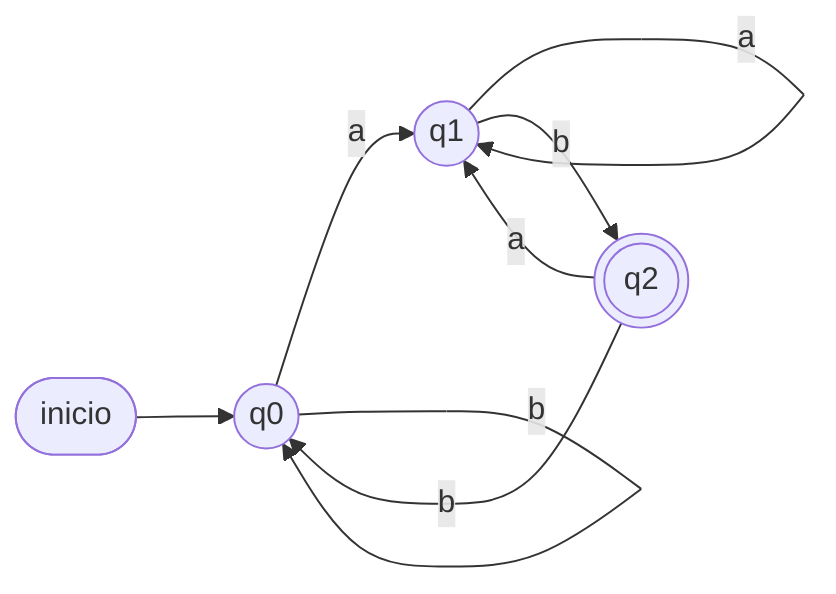
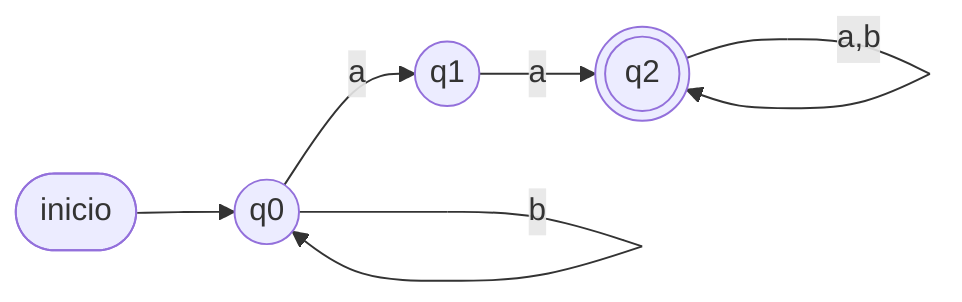
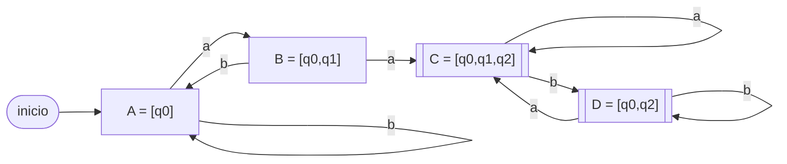
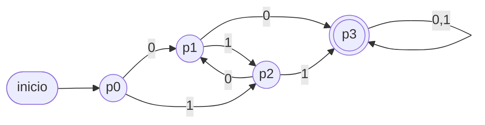

# Soluciones desarrolladas — Ejercicios por tipo

> Intenta resolver por tu cuenta antes de leer. Notación: `M = (Q, Σ, δ, q0, F)`.

---

## Tipo A — Lenguajes y gramáticas

**A1.** `L = {aⁿb / n ≥ 0}` → `b, ab, aab, aaab, aaaab`.
Descripción: *cero o más `a`'s seguidas de exactamente una `b`*.

**A2.** `L = {abⁿa / n ≥ 0} = {aa, aba, abba, …}`. GR:

```
S → aA
A → bA | a
```
Verificación: `S→aA→a·a = aa` (n=0); `S→aA→abA→ab·a = aba` (n=1). ✓

**A3.** `L = {ω / #a par y #b par}`. GLC (del apunte, G₃):

```
S → aSa | bSb | aAb | bAa | ε      A → aSb | bSa
```
Árbol de derivación de `abba`:
```
S → aSa → a(bSb)a → a b (ε) b a = abba
```
`S ⇒ aSa ⇒ abSba ⇒ abba` (con `S → ε`). ✓ (2 a's, 2 b's, ambas pares.)

**A4.** `G = ({a,b},{S,A},{S→aS|aA|a, A→bS}, S)`.
`L(G) = {ω ∈ {a,b}* / ω empieza y termina en a, y no tiene dos b's consecutivas}`.
Razonamiento: la única forma de terminar es `S → a` (toda palabra termina en a);
toda derivación de `S` agrega una `a` (toda palabra empieza en a); `A` agrega una
`b` y obliga a volver a `S` (nunca dos b's seguidas).

---

## Tipo B — Transformación GRE → GR

**B1.** `A → abA | ba | ε`. La producción `abA` tiene dos terminales y `ba` también.
Descomponemos con auxiliares:

```
A  → aX₁ | bX₂ | ε
X₁ → bA
X₂ → a
```
Cada producción queda en forma `A → aB`, `A → a` o `A → ε`. ✓

**B2.** **Trampa didáctica.** Revisemos cada producción de `G₁`:

```
S → aS | aA | aB | ε      (todas forma  A→aB  o  A→ε)  ✓ regular
A → bB | cC | aS | ε      (todas forma  A→aB  o  A→ε)  ✓ regular
B → aB | bC | cA | ε      (todas forma  A→aB  o  A→ε)  ✓ regular
C → a  | b  | c  | ε      (todas forma  A→a   o  A→ε)  ✓ regular
```

**Todas las producciones ya están en forma regular** (un terminal, o un terminal
seguido de un solo no terminal, o ε). Por lo tanto `G₁` **ya es una GR**: su GR
equivalente es ella misma; no hay palabras largas que descomponer. El ejercicio
evalúa si reconoces la forma regular y no "inventas" una transformación innecesaria.

---

## Tipo C — Diseño de AFD

**C1.** AFD que acepta palabras **que terminan en `ab`**.
`Q = {q0, q1, q2}`, `q0` inicial, `F = {q2}`.

| δ | a | b |
|---|---|---|
| → q0 | q1 | q0 |
| q1 | q1 | q2 |
| * q2 | q1 | q0 |

- q0: aún no hay una `a` "pendiente". q1: última leída es `a`. q2: acabo de leer `ab`.
- Verif.: `ab`: q0→q1→q2 ✓; `abb`: q0→q1→q2→q0 ✗; `aab`: q0→q1→q1→q2 ✓.



**C2.** `L = {#a impar y #b par}`. Estados `(#a mod 2, #b mod 2)`:

| δ | a | b |
|---|---|---|
| → q00 | q10 | q01 |
| * q10 | q00 | q11 |
| q01 | q11 | q00 |
| q11 | q01 | q10 |

`q00` inicial (a par, b par), `F = {q10}` (a impar, b par). Leer `a` cambia la 1ª
paridad; leer `b`, la 2ª.


**C3.** AFD **mínimo** para `#0 par` **y** `#1 impar`. Como las dos condiciones son
independientes, hay `2 × 2 = 4` combinaciones ⇒ **4 estados** (y son todos
distinguibles, así que es mínimo):

- `q00`: 0's par, 1's par — inicial, **no** final.
- `q01`: 0's par, 1's impar — **FINAL** ✓.
- `q10`: 0's impar, 1's par — no final.
- `q11`: 0's impar, 1's impar — no final.

| δ | 0 | 1 |
|---|---|---|
| → q00 | q10 | q01 |
| * q01 | q11 | q00 |
| q10 | q00 | q11 |
| q11 | q01 | q10 |

Verif. `001`: q00→q10→q00→q01 ∈ F ✓. `0011`: q00→q10→q00→q01→q00 ∉ F ✗.


---

## Tipo D — AFD vs AFND (subcadena `aa`)

**D1 (A) AFD.** `Q = {q0,q1,q2}`, `q0` inicial, `F = {q2}`:

| δ | a | b |
|---|---|---|
| → q0 | q1 | q0 |
| q1 | q2 | q0 |
| * q2 | q2 | q2 |

q0 = ninguna `a` seguida; q1 = una `a`; q2 = ya vi `aa` (absorbe todo).


**D1 (B) AFND.** `Q = {q0,q1,q2}`, `q0` inicial, `F = {q2}`:

```
δ(q0,a) = {q0, q1}    δ(q0,b) = {q0}
δ(q1,a) = {q2}        δ(q1,b) = ∅   (el hilo muere)
δ(q2,a) = {q2}        δ(q2,b) = {q2}
```

| δ | a | b |
|---|---|---|
| → q0 | {q0,q1} | {q0} |
| q1 | {q2} | ∅ |
| * q2 | {q2} | {q2} |

Verif. `baa`: `{q0}→b→{q0}→a→{q0,q1}→a→{q0,q1,q2}`. Contiene `q2` ⇒ **ACEPTA** ✓.



Ambos reconocen el mismo lenguaje (palabras con subcadena `aa`). El AFD necesita
recordar cuántas `a` consecutivas lleva; el AFND aprovecha el no-determinismo para
"adivinar" dónde empieza `aa`.

**D2. Análisis de hilos (sobre el AFND).**

`aba` (debe **rechazar**):
```
{q0} →a→ {q0,q1} →b→ {q0} →a→ {q0,q1}
```
Estado final del conjunto `{q0,q1}`, no contiene `q2` ⇒ **RECHAZA** ✓.

`baab` (debe **aceptar**):
```
{q0} →b→ {q0} →a→ {q0,q1} →a→ {q0,q1,q2} →b→ {q0,q2}
```
`{q0,q2}` contiene `q2` ⇒ **ACEPTA** ✓.

---

## Tipo E — Conversión a AFD (subconjuntos)

**E1.** AFND dado (es el mismo de D1-B). Construcción de subconjuntos desde `[q0]`:

- `A = [q0]`: a→`{q0,q1}`, b→`{q0}`
- `B = [q0,q1]`: a→`{q0,q1,q2}`, b→`{q0}`
- `C = [q0,q1,q2]`: a→`{q0,q1,q2}`, b→`{q0,q2}`
- `D = [q0,q2]`: a→`{q0,q1,q2}`, b→`{q0,q2}`

| δ_D | a | b |
|---|---|---|
| → A = [q0] | B | A |
| B = [q0,q1] | C | A |
| * C = [q0,q1,q2] | C | D |
| * D = [q0,q2] | C | D |

Finales `= {C, D}` (contienen `q2`). Todos los estados son alcanzables ⇒ no hay
inalcanzables que tachar.



> Nota: en Mermaid el doble círculo `(((…)))` no admite corchetes en la etiqueta,
> por eso los estados finales `C` y `D` se dibujan con nodo de **doble borde** `[[ ]]`.

**E2.** AFND-ε: `δ(q0,ε)={q1}`, `δ(q0,a)={q0}`, `δ(q1,b)={q2}`, `δ(q2,ε)={q1}`,
`F={q2}`. Primero las **ε-clausuras**:
`εcl(q0)={q0,q1}`, `εcl(q1)={q1}`, `εcl(q2)={q1,q2}`.

Estado inicial del AFD = `εcl(q0) = {q0,q1} = S0`.

- `S0 = {q0,q1}`: con `a` → mueve `{q0}`, εcl → `{q0,q1} = S0`.
  Con `b` → mueve `{q2}`, εcl → `{q1,q2} = S1`.
- `S1 = {q1,q2}` (**final**, contiene q2): con `a` → `∅`. Con `b` → `{q2}`, εcl → `S1`.

| δ_D | a | b |
|---|---|---|
| → S0 = {q0,q1} | S0 | S1 |
| * S1 = {q1,q2} | ∅ | S1 |

Lenguaje resultante: `L = a* b⁺` (cualquier cantidad de `a`, luego al menos una `b`).

---

## Tipo F — Minimización

**F1.** Estados no finales `{q0,q1,q2}`, finales `{q3,q4,q5,q6,q7,q8}`.

`Π₀ = { q0 q1 q2 | q3 q4 q5 q6 q7 q8 }`

Refinamiento del grupo no final:
```
q0: 0→q1(NF), 1→q2(NF)
q1: 0→q3(F),  1→q2(NF)      → q1 se separa (con 0 va a F)
q2: 0→q1(NF), 1→q4(F)       → q2 se separa de q0 (con 1 va a F)
```
El grupo final `{q3..q8}`: todas sus transiciones (con 0 y con 1) caen dentro del
mismo grupo final ⇒ no se parte.

`Π₁ = { q0 | q1 | q2 | q3 q4 q5 q6 q7 q8 }`  y  `Π₂ = Π₁` (estable).

AFD mínimo con `p0=q0, p1=q1, p2=q2, p3={q3…q8}`, `F={p3}`:

| δ | 0 | 1 |
|---|---|---|
| → p0 | p1 | p2 |
| p1 | p3 | p2 |
| p2 | p1 | p3 |
| * p3 | p3 | p3 |

(De 9 estados a 4. Este AFD acepta `{x ∈ {0,1}* / x contiene 00 ó 11}`.)



---

## Tipo G — Autómatas apiladores

**G1.** `L = {aⁿbⁿ / n > 0}`, `Γ = {X, Z}`. Se acepta con pila vacía (queda `Z`):

| Γ \ input | a | b |
|---|---|---|
| **Z** (tope) | q0 \ push(X) | q_fail |
| **X** (tope) | q0 \ push(X) | q1 \ pop() |

En `q1`, cada `b` restante hace `pop()`; al ver `Z` con la entrada terminada,
se acepta. Cada `a` apila una `X`; cada `b` desapila una ⇒ igual número.
Aristas leídas como `entrada, tope / reemplazo`:


**G2.** `L = {aᵐbⁿ / m = n+1}` (una `a` de más). Apilar una `X` por cada `a`;
desapilar una por cada `b`; al final debe quedar **exactamente una** `X`:

```
q0, a, Z → (q0, XZ)      q0, a, X → (q0, XX)     # apilar a's
q0, b, X → (q1, pop)                              # empieza a consumir b's
q1, b, X → (q1, pop)
q1, ε, X → (q2, pop)     # queda 1 X: se saca y verifica que debajo está Z
q2, ε, Z → (qf, Z)       # aceptación
```
Si sobrara más de una `X`, en `q2` el tope sería `X` (no `Z`) y no se acepta.


**G3.** `L = {aᵐbⁿ / m = 2n}` (dos `a` por cada `b`). Apilar `X` por cada `a`;
por cada `b` desapilar **dos** `X` (una al leer `b`, otra con un `ε`):

```
p, a, Z → (p, XZ)     p, a, X → (p, XX)     # apilar a's
p, b, X → (q, pop)     # leer b: primer pop
q, ε, X → (p, pop)     # segundo pop, vuelve a leer b's
p, ε, Z → (qf, Z)      # pila vacía ⇒ aceptar
```
Verif. `aab` (m=2,n=1): `XZ→XXZ` (a,a); `b`: pop→`XZ`(q); ε pop→`Z`(p); ε,Z→acepta ✓.


---

## Tipo H — Máquinas de Turing (unario)

**H1.** `f(n,m) = n + m`. Entrada `|ⁿ + |ᵐ`. Como reemplazar `+` por `|` deja
`n + 1 + m` marcas, hay que borrar **una** marca al final:

```
q0: mover a la derecha sobre '|'; al leer '+', escribir '|', mover derecha → q1
q1: mover a la derecha sobre '|'; al leer B, mover izquierda → q2
q2: escribir B (borra la última '|') → HALT
```
Resultado: un bloque contiguo de `n + m` marcas `|`.
Ej.: `|||+||||` → `|||||||` = 7 = 3+4. ✓

**H2.** `f(n,m) = n * m`. Estrategia (multicinta recomendada):

- Cinta 1: entrada `|ⁿ * |ᵐ`. Cinta 2 (resultado), inicialmente vacía.
- Por **cada** una de las `m` marcas del segundo bloque, **copiar** las `n` marcas
  del primer bloque al final de la cinta 2.
- Se usan estados para: (1) marcar/recorrer una `|` del bloque `m`, (2) recorrer
  las `n` marcas copiándolas, (3) volver y repetir hasta agotar el bloque `m`.
- Al terminar, la cinta 2 contiene `n · m` marcas.

Es más engorroso con una sola cinta (hay que "tachar" marcas ya usadas con un
símbolo auxiliar), pero equivalente en poder.

---

## Tipo I — Expresiones regulares

**I1.** `L((a+b)* ab)` = palabras sobre `{a,b}` **que terminan en `ab`**.
Ejemplos: `ab, aab, bab, abab, bbab`. Comprensión: `{ω ∈ {a,b}* / ω termina en ab}`.

**I2.** "Terminan en `01`" sobre `{0,1}`: `(0 + 1)* 01`.

**I3.** `(a* + b*)*`. Como `a*` genera bloques de `a` y `b*` bloques de `b`, y la
estrella exterior permite alternarlos libremente, se obtiene **todas** las palabras:
`L = {a,b}*` (incluida `ε`).

**I4.** AFND-ε de Thompson para `a(a + b)*`:

1. `a`: `n0 —a→ n1`.
2. `(a+b)` (unión): nuevo inicial `u0` con `ε` a dos ramas `ua0 —a→ ua1` y
   `ub0 —b→ ub1`; ambas salidas con `ε` a un final `u1`.
3. `(a+b)*` (estrella): nuevo `s0` y `sf`; `ε`: `s0→u0`, `u1→u0` (repetir),
   `s0→sf` (aceptar cero repeticiones), `u1→sf`.
4. Concatenación `a · (a+b)*`: conectar `n1 —ε→ s0`.

Inicial `n0`, único final `sf` (sin transiciones de salida), según las
restricciones de Thompson.
