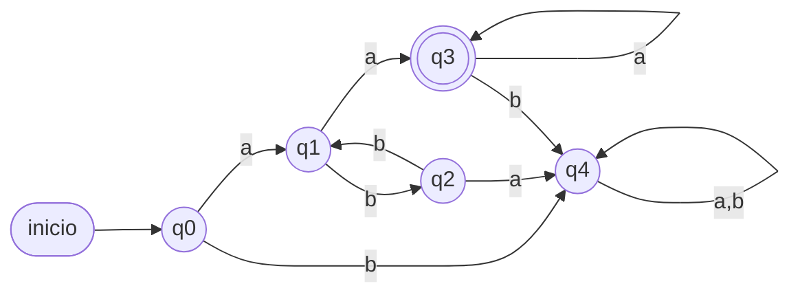
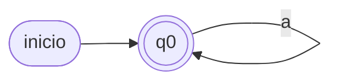
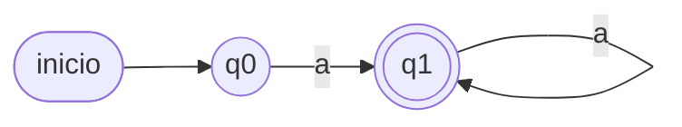
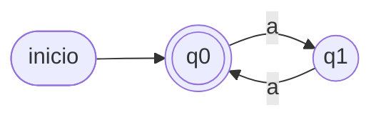
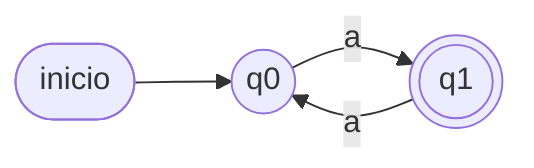
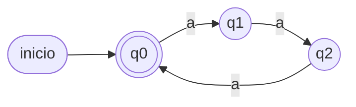
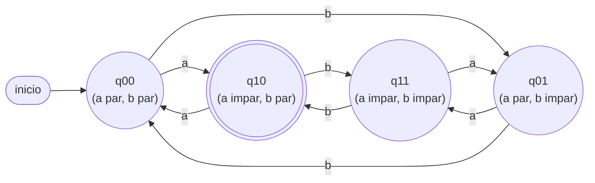
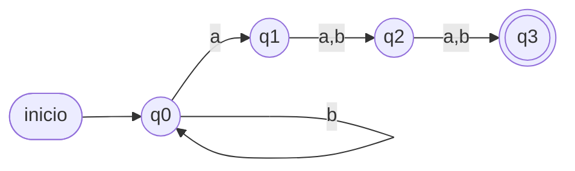
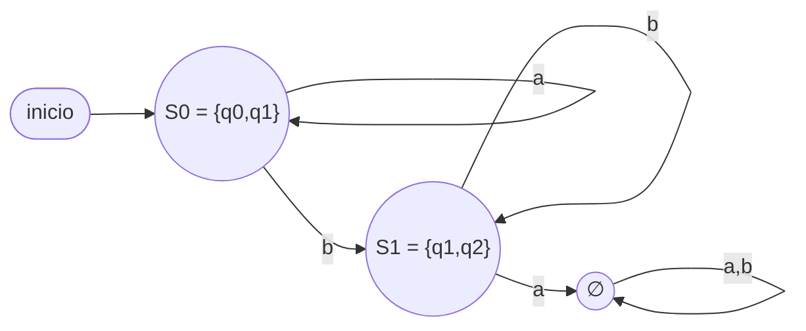
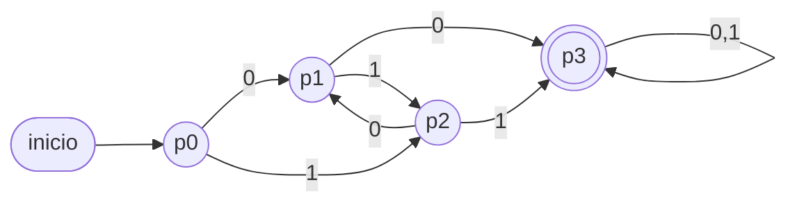

# Módulo 2 — Autómatas finitos

> Basado en la clase U3C2 y el apunte *Autómatas Finitos*.

## 2.1 Idea intuitiva

Un **autómata** es un dispositivo lector que decide si una palabra pertenece o no
a un lenguaje; es un modelo primitivo de computador. Tiene una cantidad **finita**
de estados internos que van cambiando a medida que lee, símbolo a símbolo, un
string de entrada. Al terminar la lectura entrega una respuesta lógica:
**aceptada** (✓) o **rechazada** (✗).

Se describe con un **diagrama de estados (DE)**:

- El **estado inicial** se marca con una flecha sin origen.
- Los **estados finales** (de aceptación) se dibujan con **doble círculo**.
- Una transición `δ(eᵢ, a) = eⱼ` se dibuja como un arco de `eᵢ` a `eⱼ` rotulado `a`.

## 2.2 Definición formal

Un **Autómata Finito Determinista (AFD)** es un quíntuple:

```
M = (Q, Σ, δ, q0, F)
```

- **Q:** conjunto finito de estados.
- **Σ:** alfabeto de entrada.
- **δ:** función de transición de estados.
- **q0:** estado inicial, `q0 ∈ Q`.
- **F:** conjunto de estados finales, `F ⊆ Q`.

El apunte usa la notación equivalente `M = ⟨E, A, δ, e0, F⟩`.

### Determinista vs no determinista

| | δ | Interpretación |
|---|---|---|
| **AFD** | `δ: Q × Σ → Q` | Para cada estado y símbolo, **a lo sumo una** transición. |
| **AFND** | `δ: Q × Σ → P(Q)` | Puede haber **0, 1 o varias** transiciones (conjunto de destinos). |
| **AFND-ε** | idem + `δ(q, ε)` | Además permite **saltos espontáneos** sin leer símbolo. |

`P(Q)` es el conjunto potencia (todos los subconjuntos de Q).

## 2.3 Función de transición para cadenas: δ*

`δ` opera sobre *un símbolo*; su extensión `δ*: Q × Σ* → Q` opera sobre *una
cadena* y devuelve el estado alcanzado tras leerla:

```
δ*(q, ε)  = q
δ*(q, xa) = δ(δ*(q, x), a)     con x ∈ Σ*, a ∈ Σ
```

**Lenguaje aceptado:**
```
L(M) = {ω ∈ Σ* / δ*(q0, ω) ∈ F}
```
Los lenguajes aceptados por autómatas finitos se llaman **lenguajes regulares**.

## 2.4 Tabla de transición

Forma tabular de `δ`. Filas = estados (se marca `→` el inicial y `*` los finales),
columnas = símbolos.

**Ejemplo.** `L = {ω = abᵐaⁿ / m par, n > 0}`:

| δ | a | b |
|---|---|---|
| → q0 | q1 | q4 |
| q1 | q3 | q2 |
| q2 | q4 | q1 |
| * q3 | q3 | q4 |
| q4 | q4 | q4 |

Lectura: `q1` = cantidad **par** de `b` leídas; `q2` = cantidad **impar**; `q3` =
aceptación (ya llegó ≥1 `a` final tras un número par de `b`). `q4` es un **estado
colector de basura** (o "trampa"): absorbe toda entrada que ya no puede formar una
palabra válida. Diagrama:



## 2.5 Autómatas básicos (patrones que conviene memorizar)

Con `Σ = {a}` y contando ocurrencias de `a`. Memoriza estos cinco moldes: casi
todo AFD de una sola letra es una combinación de ellos.

**1) `aⁿ, n ≥ 0`** — acepta también `ε`; el estado inicial **es** final, con un
lazo `a`.



**2) `aⁿ, n > 0`** — el inicial **no** es final; tras la primera `a` se llega a un
final que se auto-mantiene.



**3) `aⁿ, n par`** — dos estados que alternan; el final es el de conteo **par**
(el inicial, que también acepta `ε`).



**4) `aⁿ, n impar`** — misma estructura, pero ahora el final es el estado de
conteo **impar** (`ε` ya no se acepta).



**5) `aⁿ, n múltiplo de k`** — un **ciclo de `k` estados**; el final es `q0`
(ejemplo con `k = 3`; para "no múltiplo de k" bastaría con marcar como finales los
otros estados).



**Diseño con condiciones de paridad combinadas** (producto cartesiano). Para
`L = {ω / #a impar y #b par}` se usan 4 estados `(#a mod 2, #b mod 2)`; leer `a`
cambia la paridad de a, leer `b` la de b; final = `(1, 0)`. Es el "cuadrado" que
combina dos patrones de paridad a la vez:



> **Regla mnemotécnica:** contar "módulo k" ⇒ **ciclo de k estados**; combinar dos
> condiciones independientes ⇒ **producto cartesiano** (multiplica los estados).

## 2.6 Diseño directo de un AFND

No siempre conviene pensar primero en un AFD: si el lenguaje se describe
naturalmente como "en algún punto de la palabra ocurre X", suele ser mucho más
simple diseñar **directamente** un AFND, dejando que el no-determinismo
"adivine" en qué posición ocurre X.

**Ejemplo motivador.** Sea `Σ = {a, b}` y
`L = {ω / el símbolo en la posición |ω|−2 es 'a'}` (es decir, la **tercera
letra contada desde el final** es `a`, con `|ω| ≥ 3`).

Como **AFD**, la máquina tendría que **recordar los últimos 3 símbolos
leídos** en todo momento (para saber, al terminar, cuál fue el que quedó a 3
posiciones del final) — eso exige `2³ = 8` estados, uno por cada combinación
posible de los últimos 3 símbolos.

Como **AFND**, basta con dejar que, en cualquier momento, un "hilo" **adivine**
que el símbolo que se está leyendo es el candidato a tercera-desde-el-final, y
a partir de ahí solo hay que **contar 2 símbolos más**:

```
δ(q0,a) = {q0,q1}    δ(q0,b) = {q0}     (q0: sigue esperando, o "apuesta" a que
                                          la letra actual es la 3ª desde el final)
δ(q1,a) = {q2}       δ(q1,b) = {q2}     (q1: ya leyó la candidata; cualquier
                                          símbolo cuenta como penúltimo)
δ(q2,a) = {q3}       δ(q2,b) = {q3}     (q2: leyó el penúltimo; cualquier
                                          símbolo cuenta como el último)
F = {q3}
```



Solo **4 estados** en vez de 8. Verif. `aab` (3ª desde el final = 1ª letra =
`a`): `{q0}→a→{q0,q1}→a→{q0,q1,q2}→b→{q0,q2,q3}`, contiene `q3` ⇒ **ACEPTA**.
`baa` (3ª desde el final = `b`): `{q0}→b→{q0}→a→{q0,q1}→a→{q0,q1,q2}`, sin
`q3` ⇒ **RECHAZA**.

**Regla práctica:** si el enunciado suena a *"en algún punto pasa algo, y lo
que importa es lo que viene después"*, prueba primero con un AFND: cada hilo
representa una hipótesis distinta de "dónde empieza lo importante", y no hace
falta enumerar combinaciones como exigiría un AFD equivalente.

## 2.7 Equivalencia AFND → AFD (construcción de subconjuntos)

**Teorema.** Para todo AFND existe un AFD que acepta el mismo lenguaje.

Dado `M_ND = (E_ND, A, δ_ND, e0, F_ND)`, el AFD correspondiente
`M_D = (E_D, A, δ_D, [e0], F_D)` se construye así:

1. **Estados:** subconjuntos de `E_ND`. Cada estado del AFD se escribe
   `[e₁, e₂, …, eᵢ]` (un único estado que "recuerda" un conjunto de estados del AFND).
2. **Inicial:** `[e0]` (con ε-clausura si es AFND-ε).
3. **Transición:**
   ```
   δ_D([e₁,…,eᵢ], a) = [conjunto] = ⋃_{p ∈ {e₁,…,eᵢ}} δ_ND(p, a)
   ```
   (con `δ_G(∅, a) = ∅`).
4. **Finales:** todo estado-conjunto que contenga **al menos un** estado final de `M_ND`.

> Se calcula δ_D **solo** para los estados alcanzables desde el inicial y desde los
> que se puede alcanzar un final.

**Ejemplo (del apunte).** AFND `M4_ND` que acepta
`L₄ = {x ∈ {0,1}* / x contiene 00 ó contiene 11}`.

Aplicando la construcción y luego renombrando `[e0]→q0`, `[e0,e3]→q1`, etc., se
obtiene el AFD:

| δ4D | 0 | 1 |
|---|---|---|
| q0 | q1 | q2 |
| q1 | q3 | q2 |
| q2 | q1 | q4 |
| q3 | q3 | q5 |
| q4 | q6 | q4 |
| q5 | q3 | q7 |
| q6 | q8 | q4 |
| q7 | q8 | q7 |
| q8 | q8 | q7 |

con `q0` inicial y `F = {q3, q4, q5, q6, q7, q8}`.

### AFND-ε: la ε-clausura

Un AFND-ε agrega transiciones `δ(q, ε)` que se pueden tomar **sin leer ningún
símbolo**. Se define la **ε-clausura** de un estado `q`:

```
εcl(q) = { q } ∪ { todos los estados alcanzables desde q usando solo
                    transiciones ε, cero o más veces }
```

Antes de aplicar la construcción de subconjuntos a un AFND-ε hay que **cerrar
cada conjunto de estados bajo ε**: la ε-clausura se aplica (1) al estado
inicial, para obtener el estado inicial del AFD, y (2) después de **cada**
movimiento con un símbolo, antes de seguir construyendo.

```
Estado inicial del AFD = εcl(q0)
δ_D(C, a) = εcl( ⋃_{p ∈ C} δ(p, a) )
```

**Ejemplo completo.** AFND-ε con `q0` inicial y `F = {q2}`:

```
δ(q0, ε) = {q1}    δ(q0, a) = {q0}
δ(q1, b) = {q2}    δ(q2, ε) = {q1}
```

**ε-clausuras:** `εcl(q0) = {q0,q1}` (q0 alcanza q1 por ε), `εcl(q1) = {q1}`
(sin salidas ε), `εcl(q2) = {q1,q2}` (q2 alcanza q1 por ε).

Estado inicial del AFD: `S0 = εcl(q0) = {q0,q1}`.

- `S0 = {q0,q1}`: con `a` → mueve a `{q0}`, εcl → `{q0,q1} = S0`.
  Con `b` → mueve a `{q2}`, εcl → `{q1,q2} = S1`.
- `S1 = {q1,q2}` (**final**, contiene `q2`): con `a` → `∅`. Con `b` → mueve a
  `{q2}`, εcl → `{q1,q2} = S1`.

| δ_D | a | b |
|---|---|---|
| → S0 = {q0,q1} | S0 | S1 |
| * S1 = {q1,q2} | ∅ | S1 |



Lenguaje resultante: `L = a* b⁺` (cualquier cantidad de `a`, luego al menos
una `b`). Verif. `aab`: S0→S0→S0→S1 (final) ⇒ **ACEPTA**. `aba`: S0→S0→S1→∅
⇒ **RECHAZA** (una vez que aparece `b`, ya no puede volver a leer `a`).

## 2.8 Minimización de AFD

Para cada AFD existe un AFD con **cantidad mínima** de estados que acepta el mismo
lenguaje. Algoritmo:

1. Eliminar estados **no alcanzables** desde `q0`.
2. Eliminar estados desde los que **no se alcanza** un final.
3. Partición inicial `Π₀ = {estados no finales, estados finales}`.
4. `K = 0`.
5. Construir `Π_{K+1}`: dividir cada grupo `G` de `Π_K` en subgrupos tales que dos
   estados `s`, `t` quedan juntos **sii** para **todo** símbolo `a` ambos van al
   mismo grupo de `Π_K`.
6. `K = K + 1`.
7. Si `Π_K ≠ Π_{K-1}`, volver a 5; si no, **terminar**.

Cada grupo de la partición final es un estado del AFD mínimo.

**Ejemplo (del apunte).** Minimizando el `M4D` anterior:
`Π₀ = {q0 q1 q2 | q3 q4 q5 q6 q7 q8}`. Refinando se llega a
`Π = {q0 | q1 | q2 | q3 q4 q5 q6 q7 q8}`, es decir 4 estados:
`p0=q0, p1=q1, p2=q2, p3={q3…q8}`, con `F = {p3}`. El AFD mínimo (que acepta
`{x ∈ {0,1}* / x contiene 00 ó 11}`) queda:



Se concluye: `L(M4ND) = L(M4D) = L(M4Dmin) = L₄`.

## 2.9 Variantes del apunte

### Autómata finito como modelo

Una tripla `M_M = ⟨E, A, δ⟩` (sin `e0` ni `F`), útil solo para **modelar** el
funcionamiento de un proceso (ej.: los estados de un grabador:
OFF, ON, PAUSA, AVANCE, RETROCESO, con acciones play/pausa/stop/rew/ff).

### Autómata finito traductor

Un séptuple `M_T = ⟨E, A, δ, e0, F, S, γ⟩` que, además de reconocer, **produce
salida**:

- **S:** alfabeto de salida.
- **γ: E × A → S\*:** función de traducción; en el diagrama la salida `x` se
  anota sobre el arco como `a / x`.

Extensión a cadenas: `γ*(eᵢ, ε) = ε`, `γ*(eᵢ, ωa) = γ*(eᵢ, ω)·γ(δ*(eᵢ, ω), a)`.
La traducción solo está definida si el autómata **acepta** la cadena:
`T(ω) = γ*(e0, ω) ⟺ δ*(e0, ω) ∈ F`.

Ejemplo típico: máquina expendedora que recibe monedas (input) y entrega
cambio + producto (output).

## Autoevaluación del módulo

1. Diseña un AFD sobre `{a,b}` que acepte palabras que terminan en `ab`.
2. Convierte a AFD el AFND: `δ(q0,a)={q0,q1}`, `δ(q0,b)={q0}`, `δ(q1,b)={q2}`, `F={q2}`.
3. Minimiza un AFD que hayas obtenido y verifica que acepta el mismo lenguaje.
4. Explica con tus palabras la diferencia entre `δ` y `δ*`.
