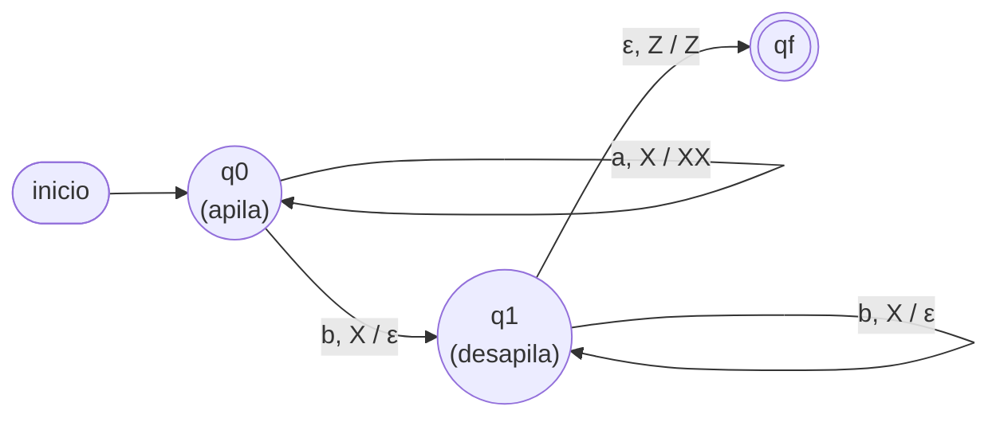

# Módulo 3 — GLC, autómatas apiladores y máquinas de Turing

> Basado en la clase U3C3.

## 3.1 Motivación: los límites de lo regular

Intenta escribir una **gramática regular** para:

```
L = {ω ∈ Σ* / ω = aⁿbⁿ, n ≥ 0}
```

No existe. Un autómata finito no puede "contar" cuántas `a` leyó para exigir la
misma cantidad de `b`: solo recuerda su estado actual, no cuántas veces pasó por
él. Sin embargo, sí hay una gramática **sencilla** que lo genera:

```
G₁ = (Σ, N, P, S),   P = {S → aSb, S → ε}
```

Simple y elegante… pero **no es regular** (a la derecha de un terminal hay otro
terminal). Lo mismo pasa con los palíndromos `ω = ωʳ`:

```
P = {S → aSa, S → bSb, S → a, S → b, S → ε}
```

## 3.2 Gramáticas libres de contexto (GLC / CFG)

**Definición.** `G = (Σ, N, P, S)` es **libre de contexto** sii toda producción
tiene la forma:

```
X → α,   con X ∈ N  y  α ∈ (N ∪ Σ)*
```

Es decir: a la izquierda **un solo** no terminal; a la derecha **cualquier**
cadena de terminales y no terminales. `G₁` y las de palíndromos son GLC.

**Ejemplo — expresiones aritméticas.** Para `Σ = {(, ), +, *, a, b, c}`:

```
E → E + E | E * E | (E) | L
L → a | b | c
```

`(a+b)*c` es generada por estas producciones; su árbol de derivación, leído por
las hojas de izquierda a derecha, reconstruye la expresión.

**Ejemplo — paréntesis/corchetes balanceados.**

```
S → CS | RS | ε      C → (S) | ()      R → [S] | []
```

genera cadenas como `([()()])[]` mediante derivaciones por la izquierda.

**Ejemplo — `aⁿbᵐ` con n > m.**

```
S → aA      A → aAb | aB | ε      B → aB | ε
```

## 3.3 Autómatas apiladores (a.a.)

Un AF no reconoce lenguajes libres de contexto por su **falta de memoria de largo
plazo**. La solución: agregarle una **pila (stack)** donde guardar los símbolos que
generaron las transiciones anteriores. Con la pila, el autómata puede, por ejemplo,
apilar cada `a` y desapilar una por cada `b`, o detectar (de forma no determinista)
la mitad de un palíndromo y comparar contra la pila.

**Definición.** Un autómata apilador es la tupla:

```
M = (Q, Σ, Γ, δ, q0, Z, F)
```

- **Q:** estados. **Σ:** alfabeto de entrada. **Γ:** alfabeto de la pila.
- **q0:** estado inicial. **Z:** símbolo inicial de la pila, `Z ∈ Γ`.
- **F:** estados finales, `F ⊆ Q`.
- **δ:** transición `δ(qᵢ, x, Y) = (qⱼ, γ)` — leyendo el símbolo de input `x` con
  `Y` en el **tope** de la pila, pasa a `qⱼ` y reemplaza el tope por `γ ∈ Γ*`
  (equivale a `push`, `pop` o dejar igual).

**Ejemplo 1 — `L = {aⁿbⁿ / n > 0}`, `Γ = {X, Z}`.**

| Γ \ input | a | b |
|---|---|---|
| **X** | q0 \ push(X) | q1 \ pop() |
| **Z** | q0 \ push(X) | q_fail |

Estrategia: cada `a` apila una `X`; cada `b` desapila; se acepta si la pila queda
vacía (queda `Z`) al terminar. Diagrama (las aristas se leen
`entrada, tope / reemplazo`):



**Ejemplo 2 — `L = {ωxωʳ / ω ∈ Σ*}`** con marca central `x`: se apilan los
símbolos de `ω`; al leer `x` se cambia de estado; luego cada símbolo se compara
haciendo `pop`.

**Ejemplo 3 — paréntesis balanceados**, `Γ = {C, Z}`: `(` hace `push(C)`,
`)` hace `pop()`, cualquier otro símbolo deja la pila igual.

## 3.4 Máquinas de Turing (MT)

El modelo más potente (tipo 0). Una **cinta infinita** de lectura/escritura y un
**cabezal** que se mueve a izquierda o derecha, escribiendo símbolos y cambiando de
estado. Reconoce cualquier lenguaje computable y además **calcula funciones**.

### Sistema unitario

Un número `n` se representa con `n` marcas `|`. `B` es el símbolo blanco.

**Suma `f(n, m) = n + m`.** Cinta de entrada `3 + 4`:
```
∞ … B B B | | | + | | | | B B B … ∞
```
Idea: la MT reemplaza el `+` por una marca `|` y borra la última `|` (o desplaza),
dejando `n + m` marcas juntas: `|||||||`.

**Producto `f(n, m) = n * m`.** Cinta de entrada `4 * 3`:
```
∞ … B B B | | | | * | | | B B B … ∞
```
Idea: copiar el bloque de `n` marcas, `m` veces, usando estados que recuerden el
avance. Se puede usar **una o varias cintas** (las MT multicinta son equivalentes
en poder a la de una sola cinta, pero más cómodas de diseñar).

### Máquinas decidibles vs calculables

- **Decidible (reconocedora):** responde sí/no sobre la pertenencia de una palabra
  a un lenguaje (se detiene siempre).
- **Calculable (transductora):** produce en la cinta el resultado de una función.

## 3.5 Cuadro comparativo de poder

| Máquina | Memoria auxiliar | Reconoce |
|---|---|---|
| Autómata finito | ninguna (solo el estado) | lenguajes regulares |
| Autómata apilador | una pila (LIFO) | lenguajes libres de contexto |
| Máquina de Turing | cinta infinita R/W | lenguajes recursivamente enumerables |

## Autoevaluación del módulo

1. Escribe una GLC para `L = {aⁿb²ⁿ / n > 0}`.
2. Diseña la tabla de transición de un a.a. para `L = {aⁿbⁿ / n > 0}`.
3. Explica por qué `aⁿbⁿ` no es regular pero sí libre de contexto.
4. Describe la estrategia de una MT que calcule `n + m` en sistema unitario.
