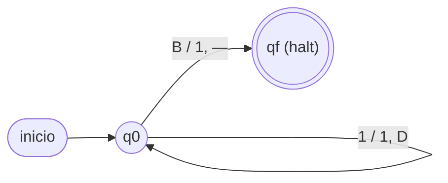

# Módulo 4 — Máquinas de Turing

> Basado en la clase U3C3 (parte de máquinas de Turing). Es la continuación
> natural del [Módulo 3 (GLC y autómatas apiladores)](03-glc-y-apiladores.md).

## 4.1 Idea intuitiva

La **máquina de Turing (MT)** es el modelo de cómputo **más potente** (tipo 0 de la
jerarquía de Chomsky). A diferencia del autómata finito (sin memoria auxiliar) y del
apilador (una pila LIFO), la MT dispone de una **cinta infinita** de
lectura/escritura recorrida por un **cabezal** que se mueve a izquierda o derecha.

En cada paso la MT:

1. **lee** el símbolo bajo el cabezal,
2. **escribe** un símbolo en esa celda (puede ser el mismo),
3. **mueve** el cabezal una celda a la izquierda o a la derecha,
4. **cambia** de estado.

Con eso puede **reconocer** lenguajes (responder sí/no) y también **calcular
funciones** (dejar el resultado en la cinta).

## 4.2 Definición formal

Una MT es una **7-upla**:

```
M = (Q, Σ, Γ, δ, q0, B, F)
```

- **Q:** conjunto finito de estados.
- **Σ:** alfabeto de entrada.
- **Γ:** alfabeto de la cinta, con `Σ ⊆ Γ`.
- **B:** símbolo **blanco**, `B ∈ Γ \ Σ` (rellena las celdas vacías).
- **δ:** función de transición `δ: Q × Γ → Q × Γ × {I, D}`
  (estado y símbolo leído ⇒ nuevo estado, símbolo escrito y movimiento
  Izquierda/Derecha).
- **q0:** estado inicial, `q0 ∈ Q`.
- **F:** conjunto de estados finales/de aceptación, `F ⊆ Q`.

Convención de lectura de las aristas en los diagramas: **`lee / escribe, mueve`**.

> **Leyenda de los diagramas:** `1` = marca (`|`), `B` = blanco,
> `D` = mover a la derecha, `I` = a la izquierda, `—` = detenerse (HALT).

## 4.3 Sistema unitario

Para calcular con números se usa la representación **unitaria**: el número `n` se
escribe con `n` marcas `|`. El símbolo `B` (blanco) separa y rodea los bloques.

### Suma `f(n, m) = n + m`

Cinta de entrada para `3 + 4`:
```
∞ … B B B | | | + | | | | B B B … ∞
```

**Idea:** al reemplazar el `+` por una marca quedan `n + 1 + m` marcas; por eso hay
que **borrar una** marca al final. Estados:

```
q0: avanza a la derecha sobre marcas; al leer '+', escribe una marca y sigue → q1
q1: avanza a la derecha sobre marcas; al leer B, retrocede una celda → q2
q2: borra esa última marca (escribe B) → HALT
```


Resultado: un bloque contiguo de `n + m` marcas. Ej.: `|||+||||` ⇒ `|||||||` (7 = 3+4).

### Sucesor `f(n) = n + 1`

El caso más simple: basta con **agregar una marca** al final del bloque.

```
q0: avanza a la derecha sobre marcas; al leer el primer B, escribe una marca → HALT
```



Ej.: `|||` (3) ⇒ `||||` (4).

### Producto `f(n, m) = n * m`

Cinta de entrada para `4 * 3`:
```
∞ … B B B | | | | * | | | B B B … ∞
```

**Idea (multicinta recomendada):** por **cada** una de las `m` marcas del segundo
bloque, **copiar** las `n` marcas del primer bloque a una cinta/zona de resultado.
Se usan estados para (1) tomar una marca del bloque `m`, (2) recorrer y copiar las
`n` marcas, y (3) volver y repetir hasta agotar el bloque `m`. Al terminar, el
resultado tiene `n · m` marcas.

Con **una sola cinta** también se puede (marcando con un símbolo auxiliar las
marcas ya usadas), pero es más engorroso. Las MT **multicinta** son equivalentes en
poder a la de una cinta, solo más cómodas de diseñar.

## 4.4 Máquinas decidibles vs calculables

- **Decidible (reconocedora):** responde **sí/no** sobre la pertenencia de una
  palabra a un lenguaje y **siempre se detiene**.
- **Calculable (transductora):** **produce** en la cinta el resultado de una
  función (como los ejemplos de suma, sucesor y producto).

Un lenguaje es **decidible** si existe una MT que lo reconoce y se detiene para toda
entrada; es **recursivamente enumerable** si existe una MT que acepta sus palabras
(pero podría no detenerse para las que no pertenecen).

## 4.5 Máquinas con varias cintas

Una MT **multicinta** tiene `k` cintas, cada una con su propio cabezal; la
transición depende de los `k` símbolos leídos y escribe/mueve en las `k` cintas. No
aumenta el **poder** (reconoce exactamente los mismos lenguajes que una MT de una
cinta), pero simplifica muchos diseños —como el producto `n * m`.

## 4.6 La MT en la jerarquía de Chomsky

La MT corona la jerarquía: cada nivel agrega poder de memoria.

| Máquina | Memoria auxiliar | Reconoce | Tipo |
|---|---|---|---|
| Autómata finito | ninguna (solo el estado) | lenguajes regulares | 3 |
| Autómata apilador | una pila (LIFO) | libres de contexto | 2 |
| Autómata linealmente acotado | cinta acotada | sensibles al contexto | 1 |
| **Máquina de Turing** | **cinta infinita R/W** | **recursivamente enumerables** | **0** |

## Autoevaluación del módulo

1. Escribe la 7-upla `M = (Q, Σ, Γ, δ, q0, B, F)` de la MT del **sucesor**.
2. Describe (estados y movimientos) una MT que calcule `n + m` para `||+|||` (2+3).
3. Explica la diferencia entre una MT **decidible** y una **calculable**.
4. ¿Por qué una MT multicinta no reconoce más lenguajes que una de una sola cinta?
5. Esboza la estrategia de una MT que calcule `2 * n` (duplicar) en unario.
