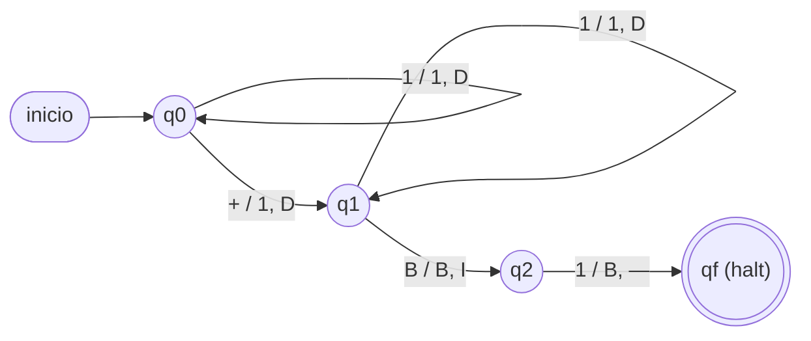
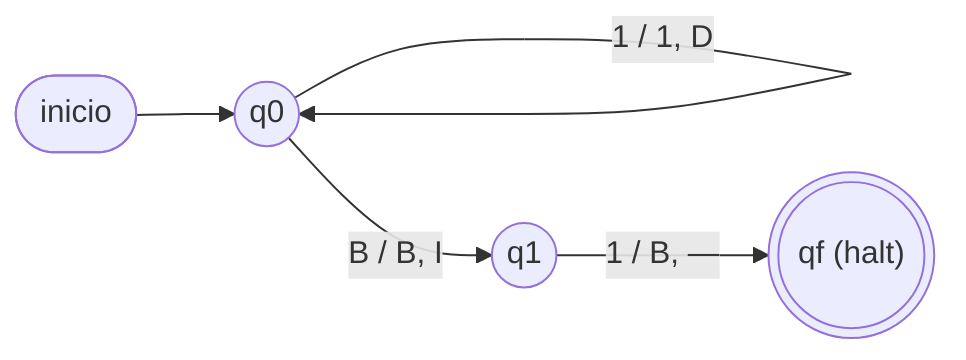
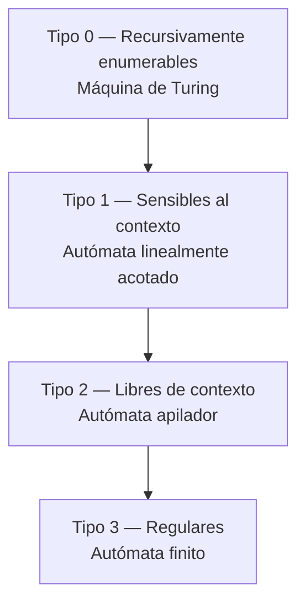

# Módulo 4 — Máquinas de Turing

> Basado en la clase U3C3 (parte de máquinas de Turing). Es la continuación
> natural del [Módulo 3 (GLC y autómatas apiladores)](03-glc-y-apiladores.md).

## 4.1 Idea intuitiva

La **máquina de Turing (MT)** es el modelo de cómputo **más potente** de la
jerarquía de Chomsky (tipo 0). Cada nivel anterior le agregó memoria al siguiente:

```
Autómata finito  →  + una pila (LIFO)  →  Autómata apilador  →  + cinta infinita  →  Máquina de Turing
   (sin memoria)        (GLC)                                        (cualquier función computable)
```

A diferencia del AF (sin memoria auxiliar) y del apilador (una pila, acceso
solo al tope), la MT dispone de una **cinta infinita** de lectura/escritura
recorrida por un **cabezal** que se mueve a izquierda o derecha, y puede
**volver a leer y sobrescribir** cualquier celda que ya visitó. Esa capacidad de
"ir y volver" es exactamente lo que le falta a un autómata finito o a un
apilador (que solo ve el tope de la pila).

En cada paso la MT:

1. **lee** el símbolo bajo el cabezal,
2. **escribe** un símbolo en esa celda (puede ser el mismo, es decir "no escribir"),
3. **mueve** el cabezal una celda a la izquierda o a la derecha (o se queda, según
   la variante),
4. **cambia** de estado.

Con este mecanismo tan simple se puede **reconocer** lenguajes (responder sí/no) y
también **calcular funciones** (dejar el resultado escrito en la cinta). La
**tesis de Church-Turing** postula que **todo lo que es "computable" en el sentido
intuitivo (con lápiz y papel, con un algoritmo) puede computarse con una MT**; por
eso se usa como la definición formal de "algoritmo".

## 4.2 Definición formal

Una MT es una **7-upla**:

```
M = (Q, Σ, Γ, δ, q0, B, F)
```

- **Q:** conjunto finito de estados.
- **Σ:** alfabeto de entrada (los símbolos que puede traer la palabra de entrada).
- **Γ:** alfabeto de la cinta, con `Σ ⊆ Γ` (incluye además símbolos auxiliares que
  la MT usa internamente, como marcas de "ya visitado").
- **B:** símbolo **blanco**, `B ∈ Γ \ Σ` (rellena las celdas vacías; nunca es parte
  de la entrada).
- **δ:** función de transición
  ```
  δ: Q × Γ → Q × Γ × {I, D}
  ```
  (estado y símbolo leído ⇒ nuevo estado, símbolo escrito y movimiento
  Izquierda/Derecha). Si `δ(q, x)` no está definida, la máquina **se detiene**
  (HALT) en ese punto.
- **q0:** estado inicial, `q0 ∈ Q`.
- **F:** conjunto de estados finales/de aceptación, `F ⊆ Q`.

**Convención de lectura de las aristas en los diagramas:** `lee / escribe, mueve`.

> **Leyenda de los diagramas:** `1` = marca (`|`), `B` = blanco,
> `D` = mover a la derecha, `I` = a la izquierda, `—` = detenerse (HALT).

### Configuración instantánea (descripción del cómputo paso a paso)

Para **trazar** la ejecución se usa la notación de **configuración** (o
*descripción instantánea*, DI): lo que hay a la izquierda del cabezal, el estado
actual, y lo que hay desde el cabezal hacia la derecha:

```
αqβ      donde α = contenido a la izquierda del cabezal
                q = estado actual
                β = contenido desde la posición del cabezal en adelante
```

Una transición `δ(q, x) = (q', y, D)` sobre la configuración `α q xβ'` produce:

```
α q x β'   ⊢   α y q' β'        (D: el cabezal avanza; y queda a la izquierda de q')
```

y si el movimiento es `I`, con `α = α'z` (z es el último símbolo de α):

```
α' z q x β'   ⊢   α' q' z y β'
```

**Ejemplo.** Para la MT del sucesor (sección 4.4), la traza de `|||` (entrada con
el cabezal al inicio) sería:

```
q0|||B  ⊢  |q0||B  ⊢  ||q0|B  ⊢  |||q0B  ⊢  |||q_f|      (HALT)
```

Leído de a un símbolo: en cada paso el estado "viaja" con el cabezal.

## 4.3 Sistema unitario

Para calcular con números se usa la representación **unitaria** (o *notación en
base 1*): el número `n` se escribe con `n` marcas `|` consecutivas. El símbolo `B`
(blanco) separa y rodea los bloques. Es la representación más simple posible,
aunque poco eficiente (para "escribir" el número 1000 se necesitan 1000 celdas);
por eso el sistema unitario se usa **solo con fines didácticos**, no en máquinas
reales.

### Suma `f(n, m) = n + m`

Cinta de entrada para `3 + 4`:
```
∞ … B B B | | | + | | | | B B B … ∞
```

**Idea:** si simplemente **reemplazamos el `+` por una marca**, quedan
`n + 1 + m` marcas seguidas; sobra exactamente **una**. Por eso hay que borrarla
al final. Estados:

```
q0: avanza a la derecha sobre marcas; al leer '+', escribe una marca y sigue → q1
q1: avanza a la derecha sobre marcas; al leer B, retrocede una celda → q2
q2: borra esa última marca (escribe B) → HALT
```



Tabla de transición equivalente (misma información que el diagrama):

| δ | 1 (marca) | + | B |
|---|---|---|---|
| → q0 | (q0, 1, D) | (q1, 1, D) | — |
| q1 | (q1, 1, D) | — | (q2, B, I) |
| q2 | (qf, B, —) | — | — |

Resultado: un bloque contiguo de `n + m` marcas. Ej.: `|||+||||` ⇒ `|||||||` (7 = 3+4).

**Traza completa de `2 + 3`** (entrada `||+|||`, cabezal al inicio en `q0`):

```
q0||+|||B
 ⊢ |q0|+|||B
 ⊢ ||q0+|||B
 ⊢ |||q1|||B     (el '+' se reemplazó por '|' y pasamos a q1)
 ⊢ ||||q1||B
 ⊢ |||||q1|B
 ⊢ ||||||q1B
 ⊢ |||||q2|      (retrocede una celda al ver B)
 ⊢ ||||qf B       (borra la última marca: 5 = 2+3) ✓
```

### Sucesor `f(n) = n + 1`

El caso más simple de todos: basta con **agregar una marca** al final del bloque.

```
q0: avanza a la derecha sobre marcas; al leer el primer B, escribe una marca → HALT
```


Ej.: `|||` (3) ⇒ `||||` (4).

### Predecesor `f(n) = n - 1` (para `n > 0`)

Simétrico al sucesor: basta con **borrar** la última marca.

```
q0: avanza a la derecha sobre marcas; al leer B, retrocede una celda → q1
q1: borra la marca (escribe B) → HALT
```



Ej.: `||||` (4) ⇒ `|||` (3). *(Nota: si `n = 0`, la cinta está vacía y no hay marca
que borrar; esta MT solo está definida para `n > 0`.)*

### Resta acotada `f(n, m) = n − m` (con `n ≥ m`, resultado ≥ 0)

Estrategia clásica: **borrar de a pares**, una marca del bloque `n` y una del
bloque `m`, hasta agotar `m`. Cinta de entrada `n | m` (con `|` como separador
distinto de las marcas, por ejemplo `#`):

```
∞ … B B 1 1 1 1 # 1 1 B B … ∞      (n=4, m=2)
```

Idea con marcado (`X` reemplaza temporalmente una marca ya usada):

```
1) Ir al final del bloque m y marcar (X) su última marca.
2) Volver al final del bloque n y borrar (B) su última marca.
3) Repetir hasta que el bloque m quede completo de X (agotado).
4) Borrar el separador y las X; lo que queda de n es el resultado.
```

Verificación conceptual: cada `X` de `m` "cancela" una marca de `n`; al agotarse
`m`, sobran exactamente `n − m` marcas.

### Comparación `n = m`? (reconocedora)

Similar a la resta, pero en vez de calcular se **decide**: se van tachando pares de
marcas (una de cada bloque); si **ambos bloques se agotan al mismo tiempo**, se
acepta (`n = m`); si uno se agota antes que el otro, se rechaza. Este es el patrón
típico para "decidir" en vez de "calcular".

### Copiar `f(n) = n·n` en el sentido de duplicar el bloque (útil para el producto)

Para copiar un bloque de `n` marcas a continuación (dejando `n` seguido de un
separador y otra copia de `n`):

```
1) Marcar la primera marca no copiada del bloque original con X.
2) Ir hasta el final de la cinta (tras el separador) y escribir una marca.
3) Volver al bloque original, encontrar la siguiente marca sin marcar y repetir.
4) Cuando todas las marcas originales están marcadas, restaurar (opcional) y HALT.
```

Esta rutina de "copiar" es exactamente la que se reutiliza, `m` veces, para
construir el **producto** (ver más abajo): copiar el bloque `n`, una vez por cada
marca del bloque `m`.

### Producto `f(n, m) = n · m`

Cinta de entrada para `4 * 3`:
```
∞ … B B B | | | | * | | | B B B … ∞
```

**Idea (multicinta recomendada, cinta 1 = entrada, cinta 2 = resultado):**

```
Por cada una de las m marcas del segundo bloque (cinta 1):
    copiar las n marcas del primer bloque (cinta 1) al final de la cinta 2
Al terminar, la cinta 2 contiene n · m marcas.
```

Se usan estados para: (1) marcar/recorrer una `|` del bloque `m` sin repetirla,
(2) recorrer las `n` marcas del bloque `n` copiándolas a la cinta 2, (3) volver y
repetir hasta agotar el bloque `m`. Al terminar, la cinta 2 contiene `n · m` marcas.

Con **una sola cinta** también se puede, aplicando repetidamente la rutina de
"copiar" de más arriba y usando un símbolo auxiliar (`X`) para no volver a contar
una marca de `m` ya usada — es más engorroso de escribir pero **equivalente en
poder**. Las MT **multicinta** no reconocen lenguajes distintos a los de una MT de
una sola cinta; solo hacen el diseño más cómodo.

## 4.4 Máquinas reconocedoras (deciden pertenencia a un lenguaje)

Además de calcular funciones, una MT puede usarse como **reconocedor**: recibe una
palabra en la cinta y **acepta** (llega a un estado de `F` y se detiene) o
**rechaza** (se detiene fuera de `F`, o nunca se detiene).

### Ejemplo — `L = {aⁿbⁿcⁿ / n ≥ 1}`

Este lenguaje **no es libre de contexto** (ningún apilador, con una sola pila, lo
reconoce: necesitaría "comparar" tres cantidades a la vez). Una MT sí puede,
usando la cinta como memoria de largo alcance:

```
Repetir:
  1) Buscar la primera 'a' no marcada (por la izquierda), marcarla con X.
  2) Avanzar hasta la primera 'b' no marcada, marcarla con Y.
  3) Avanzar hasta la primera 'c' no marcada, marcarla con Z.
  4) Volver al inicio de la cinta.
Hasta que ya no queden 'a' sin marcar.
Verificar que tampoco queden 'b' ni 'c' sin marcar (mismo n) ⇒ ACEPTAR.
Si en algún paso falta una b o una c correspondiente ⇒ RECHAZAR.
```

Esta es la razón por la que `aⁿbⁿcⁿ` sirve como ejemplo clásico de "lo que un
apilador no puede pero una MT sí": el apilador solo puede comparar **dos**
cantidades con una pila (empujar con `a`, sacar con `b`); para comparar **tres**
haría falta una segunda pila, lo cual ya es un modelo con más poder — y una MT lo
logra con una sola cinta gracias a que puede recorrerla de ida y vuelta.

### Ejemplo — palíndromos `L = {ω ∈ {a,b}* / ω = ωʳ}`

```
Repetir:
  1) Leer el símbolo más a la izquierda sin marcar; recordarlo (en el estado).
  2) Marcarlo y moverse hasta el símbolo más a la derecha sin marcar.
  3) Comparar: si coincide con el recordado, marcarlo también y volver al inicio.
     Si no coincide, RECHAZAR.
Hasta que quede 0 o 1 símbolo sin marcar en el centro ⇒ ACEPTAR.
```

Es el mismo patrón "ir y volver comparando extremos" que ya vimos con el
autómata apilador (Módulo 3), pero aquí no hace falta pila: la propia cinta guarda
el progreso mediante los símbolos marcados.

## 4.5 Máquinas decidibles vs calculables

- **Decidible (reconocedora):** responde **sí/no** sobre la pertenencia de una
  palabra a un lenguaje y **siempre se detiene** (para toda entrada, acepte o
  rechace). Los ejemplos de `aⁿbⁿcⁿ` y palíndromos de arriba son decidibles.
- **Calculable (transductora):** **produce** en la cinta el resultado de una
  función, y también se espera que se detenga siempre que la función esté
  definida (como los ejemplos de suma, sucesor, predecesor y producto).

Un lenguaje es:

- **Decidible (recursivo):** existe una MT que lo reconoce y **se detiene siempre**
  (acepta o rechaza, nunca queda en bucle infinito).
- **Recursivamente enumerable (semidecidible):** existe una MT que **acepta**
  exactamente sus palabras, pero para las palabras que **no** pertenecen podría
  **no detenerse nunca** (se queda calculando para siempre, sin nunca decir "no").

Todo lenguaje decidible es recursivamente enumerable, pero no al revés — existen
lenguajes recursivamente enumerables que no son decidibles.

### El problema de la detención (halting problem)

Un resultado célebre (Turing, 1936): **no existe** una MT general que, dada
cualquier MT `M` y cualquier entrada `ω`, decida siempre si `M` se detiene al
procesar `ω`. Es decir, el **problema de la detención es indecidible**. Esto marca
un límite teórico absoluto: hay preguntas perfectamente bien planteadas que
**ningún algoritmo** puede responder siempre correctamente. Se demuestra por
diagonalización (de forma análoga a como Cantor prueba que los reales no son
numerables), suponiendo que existe tal MT y construyendo una entrada que la
contradice.

## 4.6 Máquinas con varias cintas

Una MT **multicinta** tiene `k` cintas, cada una con su propio cabezal
independiente; la transición depende de los `k` símbolos leídos simultáneamente y
escribe/mueve en las `k` cintas a la vez. Formalmente, se generaliza `δ` a:

```
δ: Q × Γᵏ → Q × Γᵏ × {I, D}ᵏ
```

**No aumenta el poder**: toda MT multicinta puede simularse con una MT de una sola
cinta (dividiendo la cinta en "pistas", una por cada cinta original), de modo que
reconoce exactamente los mismos lenguajes — solo puede ser **más lenta** la
versión de una cinta. La ventaja de usar varias cintas es exclusivamente **de
diseño**: hace mucho más cómodo, por ejemplo, el producto `n·m` (una cinta para
cada operando y una para el resultado) o comparar dos cadenas símbolo a símbolo.

## 4.7 Variantes equivalentes (todas del mismo poder)

Los siguientes cambios al modelo **no** alteran qué lenguajes son reconocibles
(se puede simular cada uno con la MT básica de una cinta):

- **Cinta semi-infinita** (solo hacia la derecha) vs. **bi-infinita**.
- **No determinismo** (`δ` devuelve un conjunto de opciones): toda MT no
  determinista tiene una MT determinista equivalente (más lenta, pero mismo
  lenguaje).
- **Varias cintas** (sección 4.6).
- **Alfabeto de cinta más grande o más chico** (mientras alcance para codificar Σ).

Esta robustez —tantas variantes distintas y todas equivalentes— es parte de por
qué la tesis de Church-Turing resulta tan convincente como definición de
"computable".

## 4.8 La MT en la jerarquía de Chomsky

La MT corona la jerarquía: cada nivel agrega poder de memoria.

| Máquina | Memoria auxiliar | Reconoce | Tipo | Ejemplo típico |
|---|---|---|---|---|
| Autómata finito | ninguna (solo el estado) | lenguajes regulares | 3 | `aⁿ` |
| Autómata apilador | una pila (LIFO) | libres de contexto | 2 | `aⁿbⁿ` |
| Autómata linealmente acotado | cinta acotada al tamaño de la entrada | sensibles al contexto | 1 | `aⁿbⁿcⁿ` (con restricciones) |
| **Máquina de Turing** | **cinta infinita R/W** | **recursivamente enumerables** | **0** | `aⁿbⁿcⁿ` (general) |



(La flecha indica **inclusión estricta**: todo lenguaje regular es libre de
contexto, todo libre de contexto es sensible al contexto, y todo sensible al
contexto es recursivamente enumerable — pero no al revés.)

## Autoevaluación del módulo

1. Escribe la 7-upla `M = (Q, Σ, Γ, δ, q0, B, F)` de la MT del **sucesor**.
2. Traza paso a paso (con configuraciones `αqβ`) la MT de la suma para `||+||` (2+2).
3. Diseña (a alto nivel) una MT que calcule el **predecesor** `n − 1` y pruébala
   con `n = 1` — ¿qué ocurre?
4. Explica la diferencia entre un lenguaje **decidible** y uno **recursivamente
   enumerable**.
5. ¿Por qué el problema de la detención es indecidible? Da la idea de la prueba.
6. ¿Por qué una MT multicinta no reconoce más lenguajes que una de una sola cinta?
7. Esboza la estrategia de una MT que **reconozca** `L = {aⁿbⁿcⁿ / n ≥ 1}`.
8. Esboza la estrategia de una MT que calcule `2·n` (duplicar) en unario.
