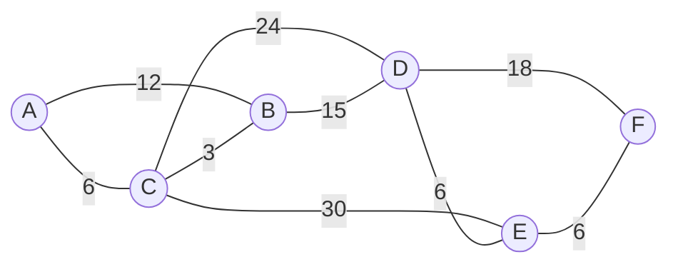
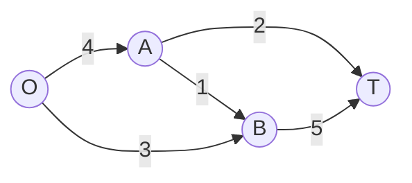

# U2 · Módulo 4 — Grafos ponderados: Dijkstra, Prim/Kruskal y Ford-Fulkerson

> Basado en la clase U2C4 (*Teoría de grafos ponderados*).

## 4.1 Grafos ponderados

Un **grafo ponderado** es aquel donde cada arista posee un valor asociado, su
**peso**: distancia, tiempo, costo o cualquier valor numérico relevante para el
problema. Regla práctica: **no mezclar** distintos tipos de pesos en un mismo
grafo.

Los tres problemas clásicos de esta clase:

| Problema | Pregunta | Algoritmo |
|---|---|---|
| **Ruta óptima** | ¿Camino de costo mínimo entre dos nodos? | Dijkstra |
| **Árbol de expansión mínima (AEM/MST)** | ¿Conectar todos los vértices al menor costo? | Prim, Kruskal |
| **Flujo máximo** | ¿Cuánto producto puedo enviar de origen a destino? | Ford-Fulkerson |

## 4.2 Ruta óptima: algoritmo de Dijkstra

**Definición.** La ruta entre dos nodos es **óptima** sii su costo es el mínimo
entre todas las rutas posibles. El algoritmo de **Dijkstra** (Edsger Dijkstra,
1930–2002) la encuentra, con supuestos: grafo ponderado, **pesos > 0**, y (en
esta clase) no se aplica sobre digrafos.

**Idea:** a cada vértice se le asocia una etiqueta `[predecesor, costo]` que se
va mejorando; en cada iteración se "cierra" (marca como definitivo) el vértice
abierto de menor costo y se relajan sus vecinos.

**Ejemplo de la clase.** Grafo con `V = {A,B,C,D,E,F}` y aristas:
`A-C 6, A-B 12, C-B 3, C-D 24, C-E 30, B-D 15, D-E 6, D-F 18, E-F 6`.



**Método tabular** (cada celda es `(costo, predecesor)`; `*` = cerrado):

| Vértice | It. 1 | It. 2 | It. 3 | It. 4 | It. 5 | It. 6 |
|---|---|---|---|---|---|---|
| A | (0,A) | * | * | * | * | * |
| B | (12,A) | (9,C) | (9,C) | * | * | * |
| C | (6,A) | (6,A) | * | * | * | * |
| D | ∞ | (30,C) | (24,B) | (24,B) | * | * |
| E | ∞ | (36,C) | (36,C) | (30,D) | (30,D) | * |
| F | ∞ | ∞ | ∞ | (42,D) | (36,E) | (36,E) |

**Lectura del resultado:** el costo mínimo de A a F es **36**, y la ruta se
reconstruye siguiendo los predecesores hacia atrás:
`F ← E ← D ← B ← C ← A`, es decir **A→C→B→D→E→F** (6+3+15+6+6 = 36 ✓).

## 4.3 Árbol de expansión mínima (AEM / MST)

**Definición.** Subgrafo que **no forma ciclos**, conecta la **totalidad** de
los vértices, y cuya suma de pesos es **mínima**. Algoritmos: **Kruskal**
(1956) y **Prim** (1957), ambos con raíces en Vojtěch Jarník (1930).

**Ejemplo de la clase.** Grafo con `V = {a,b,c,d,e,f}` y aristas (ordenadas por
peso): `ab:2, af:3, cd:3, ef:4, ce:5, df:6, ac:7, be:8, cf:8, ad:9`.

### Kruskal (elige aristas globalmente, de menor a mayor)

```
1° Escoger la arista de menor peso del grafo.
2° Seguir escogiendo la siguiente de menor peso, estén o no conectadas entre sí.
3° Descartar toda arista que formaría un ciclo con las ya elegidas.
4° Iterar hasta cubrir todos los vértices.
```

| Arista | ab | af | cd | ef | ce | df | ac | be | cf | ad |
|---|---|---|---|---|---|---|---|---|---|---|
| Peso | 2 | 3 | 3 | 4 | 5 | 6 | 7 | 8 | 8 | 9 |
| ¿Se elige? | Sí | Sí | Sí | Sí | Sí | No | No | No | No | No |

AEM = `{ab, af, cd, ef, ce}` con peso total **17** (5 aristas para 6 vértices ✓).

### Prim (crece un árbol desde un extremo)

```
1° T = vértices de la arista de menor peso del grafo. Suma = ese peso.
2° Entre las aristas incidentes a T, escoger la de menor peso.
3° Agregarla (y su vértice nuevo) si no forma ciclo; si lo forma, saltarla.
4° Repetir hasta cubrir todo el grafo. La suma acumulada es la longitud del AEM.
```

Sobre el mismo grafo: `ab(2) → af(3) → ef(4) → ce(5) → cd(3)`,
`T = {a,b,f,e,c,d}`, peso total **17** — el **mismo peso** que con Kruskal
("¡qué sorpresa!"): ambos algoritmos siempre llegan a un AEM del mismo costo
total, aunque puedan elegir aristas distintas si hay empates.

## 4.4 Flujo máximo: algoritmo de Ford-Fulkerson

**Definición.** El **flujo máximo** es el valor acumulado de "producto" que se
puede enviar desde un origen a un destino en una red con capacidades (pesos),
sin sobresaturar la red ni subutilizar recursos.

```
1° Desde el origen, construir una ruta al destino escogiendo en cada paso la
   arista de MAYOR capacidad disponible.
2° Tomar la capacidad MÍNIMA de esa ruta (cuello de botella), restarla a todas
   las aristas de la ruta y acumularla en el destino.
3° Repetir hasta agotar las posibilidades de envío desde el origen.
```

**Ejemplo pequeño (verificado).** Red dirigida con capacidades:
`O→A: 4, O→B: 3, A→T: 2, A→B: 1, B→T: 5` (origen `O`, destino `T`).



| Ronda | Ruta | Cuello de botella | Acumulado |
|---|---|---|---|
| 1 | O→A→T | mín(4,2) = **2** | 2 |
| 2 | O→B→T | mín(3,5) = **3** | 5 |
| 3 | O→A→B→T | mín(2,1,2) = **1** | **6** |

Tras la ronda 3 no quedan rutas con capacidad desde `O` ⇒ **flujo máximo = 6**.
Verificación por corte: separando `{O,A}` de `{B,T}`, las aristas que cruzan
son `O→B (3) + A→T (2) + A→B (1) = 6` ✓ (el flujo máximo iguala al corte mínimo).

En el ejemplo grande de la clase (red eléctrica en MW, origen `O`, destino `F`),
las rondas acumulan `5 + 3 + 4 + 1 + 1 = 14` MW de flujo máximo.

## 4.5 ¿Cuál algoritmo uso? (guía rápida)

| Si el problema dice… | Usa |
|---|---|
| "ruta más corta / camino de menor costo entre X e Y" | **Dijkstra** |
| "conectar todo al menor costo / cablear todas las oficinas" | **Prim o Kruskal** (AEM) |
| "cuánto se puede enviar / capacidad de la red" | **Ford-Fulkerson** |

## Autoevaluación del módulo

1. Aplica Dijkstra (método tabular) al grafo del ejemplo pero buscando la ruta
   óptima de A a E. ¿Costo y secuencia?
2. En el grafo de Kruskal del ejemplo, cambia el peso de `df` a 4 y rehaz el
   AEM. ¿Cambia el árbol? ¿Cambia el peso total?
3. ¿Por qué Kruskal debe verificar ciclos y qué pasaría si no lo hiciera?
4. En el ejemplo pequeño de flujo máximo, ¿qué arista habría que ampliar para
   aumentar el flujo total? Justifica con el corte mínimo.
