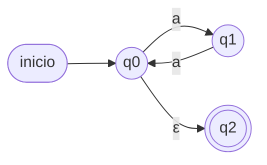

# Ensayo — Formato oficial de la Prueba 3 (INFB 8061)

> **Cómo es la prueba real** (según la pauta oficial de la Prueba 3, julio 2026):
>
> - **Duración:** 90 minutos · **Puntaje:** 120 puntos, de los cuales se
>   contestan **solo 100** (se revisan los primeros 100) · **Exigencia:** 60%
>   (60 pts = 4.0).
> - **4 preguntas grandes e integradoras** (20 + 30 + 30 + 40), no muchas
>   preguntas chicas por tema.
> - Las preguntas **combinan** los temas: un AFND-ε del que hay que extraer AFD
>   **+ gramática regular + expresión regular**; una RegEx que hay que convertir
>   a AFND-ε; un lenguaje libre de contexto que pide apilador **+ GLC + árbol de
>   derivación**; y máquinas de Turing en notación **JFLAP** (multicinta
>   permitida, solución **genérica**).
> - Es decir: aunque el temario dice "AFD, AFND, AFND-ε, pila, MT", en la
>   práctica **gramáticas y expresiones regulares aparecen integradas** como
>   parte de las preguntas de autómatas. No las descuides.
>
> Este ensayo replica ese formato con enunciados nuevos. Resuélvelo en 90
> minutos eligiendo qué 100 puntos contestar.

**Notación:** `M = (Q, Σ, δ, q0, F)` AF · `M = (Q, Σ, Γ, δ, q0, Z, F)` pila ·
`M = (Q, Σ, Γ, δ, q0, B, F)` MT.

---

## Pregunta 1 (20 puntos) — AFND-ε integrador

Dado el siguiente **AFND-ε** sobre `Σ = {a, b}` (`q0` inicial, `F = {q2}`):



Encuentra:

a) **(4 pts)** El **lenguaje por comprensión** que acepta.
b) **(6 pts)** El **Autómata Finito Determinístico** equivalente (tabla de
transiciones y diagrama; identifica los estados basura si los hay).
c) **(5 pts)** La **Gramática Regular** equivalente (producciones, N y Σ).
d) **(5 pts)** La **Expresión Regular** asociada.

---

## Pregunta 2 (30 puntos) — RegEx → AFND-ε

Encuentra el **diagrama de estados** que representa el **AFND-ε equivalente** a
la expresión regular:

```
b (aa* + bb)* aa* (bb)* a
```

Sugerencia (así asigna puntaje la pauta oficial): construye por **partes**
(L₁ = `aa*`, L₂ = `bb`, L₃ = `(bb)*`, L₄ = `(L₁+L₂)*`, …) y luego compón las
partes con transiciones ε (construcción de Thompson).

---

## Pregunta 3 (30 puntos) — Lenguaje libre de contexto integrador

Dado el lenguaje:

```
L = { ω ∈ {[, ]}* / ω son corchetes balanceados }
```

se pide escribir:

a) **(10 pts)** El **Autómata Apilador** (diagrama o tabla, con `Γ`).
b) **(10 pts)** La **Gramática Libre de Contexto**.
c) **(10 pts)** El **árbol de derivación** (secuencia de derivaciones) que
genera `ω = [[[][]]]`.

---

## Pregunta 4 (40 puntos) — Máquinas de Turing (notación JFLAP)

Se piden Máquinas de Turing usando la notación de JFLAP.
**Obs:** a) se puede usar **múltiples cintas**; b) la solución debe ser
**genérica** (para todo valor de entrada, no solo el del ejemplo).

**a) (20 pts)** Una MT que **CALCULE** `f(x, y) = 2x + 2y = 2·(x + y)`,
`∀ x, y ∈ ℕ ∪ {0}`, usando notación unitaria (ej.: 3 = III).

```
Entrada:  III#II       ⇒  x = 3, y = 2  ⇒  f(3,2)
Salida:   IIIIIIIIII   ⇒  f(3,2) = 10
```

**b) (20 pts)** Una MT que **DECIDA** `f(ω) = {S, N}` donde:

```
L = { aⁿ b²ⁿ aⁿ / n ≥ 1 }
```

Ej.: si `ω = abba` ⇒ `f(ω) = S`; si `ω = abab` ⇒ `f(ω) = N`.

---

*Puntaje total 120 — recuerda: se contestan y revisan solo 100 puntos.*
