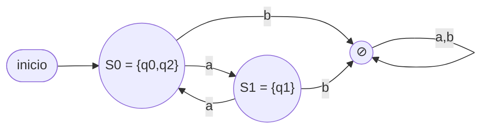
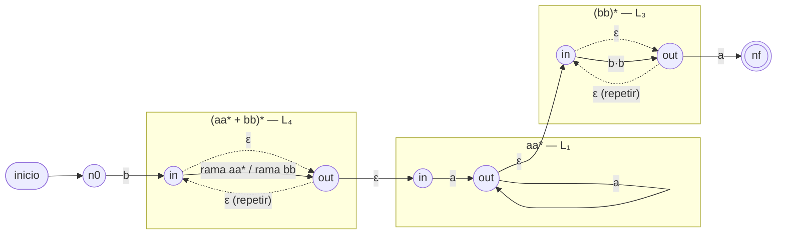
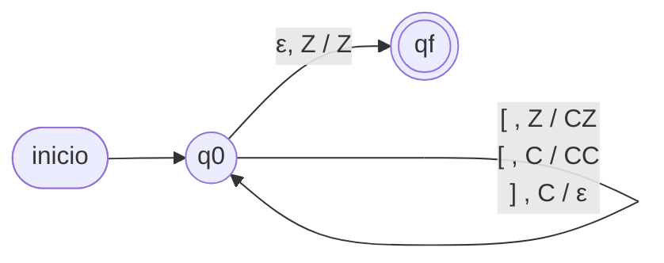

# Solucionario — Ensayo formato oficial (120 pts)

Asignación de puntaje calcada de la pauta oficial.

---

## Pregunta 1 (20 pts) — AFND-ε integrador

El AFND-ε alterna `q0 ⇄ q1` con `a` y tiene un salto espontáneo `q0 −ε→ q2`
(final). Se llega a `q2` exactamente cuando el autómata está en `q0`, es decir,
tras un número **par** de `a`.

**a) (4 pts) Lenguaje por comprensión:**
```
L = { a²ⁿ / n ≥ 0 }        (cadenas de a's de largo par, incluida ε)
```

**b) (6 pts) AFD equivalente.** ε-clausuras: `εcl(q0) = {q0,q2}`,
`εcl(q1) = {q1}`, `εcl(q2) = {q2}`. Estado inicial `S0 = {q0,q2}` (final,
contiene q2 ⇒ acepta ε):

| δ_D | a | b |
|---|---|---|
| → * S0 = {q0,q2} | S1 | ⊘ |
| S1 = {q1} | S0 | ⊘ |
| ⊘ (basura) | ⊘ | ⊘ |



Obs: `⊘` es el estado basura (toda `b` mata la palabra). Verif.: `ε` ✓ (S0
final), `aa` ✓ (S0→S1→S0), `a` ✗ (S1), `aab` ✗ (basura).

**c) (5 pts) Gramática Regular equivalente.**
```
Σ = {a,b};  N = {S, A};  P = { S → aA | ε ,  A → aS };  S inicial
```
`S` juega el rol de "par de a's leídas" (genera ε o abre un par) y `A` el de
"impar" (obliga a cerrar el par). Verif.: `S⇒ε`; `S⇒aA⇒aaS⇒aa`;
`S⇒aA⇒aaS⇒aaaA⇒aaaaS⇒aaaa` ✓.

**d) (5 pts) Expresión Regular asociada:**
```
(aa)*
```

---

## Pregunta 2 (30 pts) — RegEx → AFND-ε

`b (aa* + bb)* aa* (bb)* a`. Construcción por partes (puntaje de la pauta):

- **L₁ : `aa*`** — dos estados: arista `a` y lazo `a` en el segundo. **(2 pts)**
- **L₂ : `bb`** — tres estados encadenados con `b`, `b`. **(2 pts)**
- **L₃ : `(bb)*`** — L₂ con estrella: nuevo inicial/final, ε para saltar
  (cero repeticiones) y ε de retorno (repetir). **(2 pts)**
- **L₄ : `(L₁ + L₂)*`** — unión de L₁ y L₂ (nuevo inicial con ε a ambos,
  salidas con ε a un final común) y luego estrella sobre el conjunto. **(10 pts)**
- **L₅ : `L₄ · L₁ · L₃`** — concatenación: final de L₄ −ε→ inicial de L₁,
  final de L₁ −ε→ inicial de L₃. **(10 pts)**
- **L₆ : `b · L₅ · a`** — arista `b` inicial y arista `a` final. **(4 pts)**

Esqueleto del diagrama completo (cada bloque es el autómata del paso):



(En el desarrollo a mano se dibujan explícitos los estados internos de cada
bloque; lo evaluado es el **método modular** y las conexiones ε correctas:
un solo estado final, sin transiciones de salida.)

Verificación rápida: la palabra más corta es `b·a·a` (L₄ vacío, L₁ = `a`,
L₃ vacío, más la `a` final) = `baa` ✓ pertenece.

---

## Pregunta 3 (30 pts) — Corchetes balanceados

**a) (10 pts) Autómata Apilador.** `M = ({q0, qf}, {[, ]}, {C, Z}, δ, q0, Z, {qf})`:

```
(q0, [ , Y) → (q0, CY)     # apila una C por cada '[' (Y = cualquier tope)
(q0, ] , C) → (q0, pop)    # cada ']' cancela la C más reciente
(q0, ε , Z) → (qf, Z)      # pila vacía al terminar ⇒ balanceado ⇒ acepta
```



Si aparece `]` con tope `Z` (cerrar sin haber abierto) no hay transición ⇒
rechazo. Si la entrada termina con `C` en el tope (quedó un `[` sin cerrar)
tampoco se acepta.

**b) (10 pts) Gramática Libre de Contexto.**
```
P = { S → [S]  |  []S  |  S[]  |  λ }
```
(equivalente al clásico `S → [S] | SS | λ`; la forma dada calca la de la pauta
oficial para paréntesis.)

**c) (10 pts) Derivación de `ω = [[[][]]]`:**
```
S ⇒ [S]            (S → [S])
  ⇒ [[S]]          (S → [S])
  ⇒ [[ []S ]]      (S → []S)
  ⇒ [[ [][]S ]]    (S → []S)
  ⇒ [[ [][] ]]     (S → λ)
  =  [[[][]]]  ✓
```
(5 derivaciones; el árbol se dibuja con `S` en la raíz ramificando según cada
producción usada.)

---

## Pregunta 4 (40 pts) — Máquinas de Turing (JFLAP)

**a) (20 pts) `f(x,y) = 2·(x+y)`, entrada `Iⁿ#Iᵐ`.**

Solución en **2 cintas** (genérica), en dos fases:

*Fase 1 — sumar (en cinta 1), igual que la suma clásica:*
```
q0: avanza sobre I; al leer '#' escribe I y pasa a q1
q1: avanza sobre I; al leer B retrocede a q2
q2: borra la última I (escribe B) y va a q3 (inicio de la fase 2)
     → la cinta 1 queda con x+y marcas
```

*Fase 2 — duplicar (copiar cinta 1 a cinta 2 dos veces):*
```
q3: vuelve al inicio del bloque de la cinta 1
q4: recorre la cinta 1 de izquierda a derecha; por CADA I leída, escribe I en
    la cinta 2 y avanza ambos cabezales; al leer B en cinta 1, va a q5
q5: rebobina la cinta 1 al inicio (la cinta 2 se queda donde está) y va a q6
q6: segunda pasada idéntica a q4; al leer B en cinta 1 → HALT
     → la cinta 2 queda con 2·(x+y) marcas
```

Verif. `III#II` (x=3, y=2): fase 1 deja `IIIII` (5); fase 2 escribe 5+5 = 10
marcas en la cinta 2 = `IIIIIIIIII` ✓ = f(3,2).

**b) (20 pts) MT decisora `f(ω) ∈ {S, N}` para `L = {aⁿb²ⁿaⁿ / n ≥ 1}`.**

Estrategia de rondas de marcado (1 cinta; alfabeto de cinta `{a,b,X,Y,B,S,N}`):

```
Ronda (se repite mientras queden a's iniciales sin marcar):
 1) Marcar la PRIMERA 'a' sin marcar (por la izquierda) con X.
 2) Avanzar hasta la primera 'b' sin marcar; marcar DOS b's consecutivas con Y
    (si solo queda una b sin marcar, o ninguna → escribir N y HALT).
 3) Avanzar hasta el EXTREMO derecho; retroceder hasta la última 'a' sin marcar
    y marcarla con X (si no hay → escribir N y HALT).
 4) Volver al extremo izquierdo y comenzar otra ronda.

Al agotarse las a's iniciales:
 5) Recorrer toda la cinta: si queda cualquier símbolo sin marcar (a ó b)
    → escribir N y HALT.  Si todo está marcado y hubo al menos 1 ronda
    → escribir S y HALT.
```

Cada ronda "cancela" 1 `a` inicial + 2 `b` + 1 `a` final, exactamente la
proporción `aⁿ b²ⁿ aⁿ`.

Verif. `abba` (n=1): ronda 1 marca `a`→X, `bb`→YY, `a` final→X; no quedan a's
iniciales; nada sin marcar ⇒ **S** ✓.
Verif. `abab`: ronda 1 marca la 1ª `a`→X; busca dos b's consecutivas sin
marcar: encuentra `b`, pero la siguiente sin marcar no es contigua/solo hay una
en el bloque ⇒ al intentar marcar la segunda `b` encuentra `a` ⇒ **N** ✓.

---

## Distribución de puntaje (resumen)

| Pregunta | Contenidos integrados | Pts |
|---|---|---|
| 1 | AFND-ε → lenguaje + AFD + GR + RegEx | 20 |
| 2 | RegEx → AFND-ε (Thompson modular) | 30 |
| 3 | LLC: apilador + GLC + árbol de derivación | 30 |
| 4 | MT JFLAP: calculadora (multicinta) + decisora S/N | 40 |
| | **Total (se contestan 100)** | **120** |
