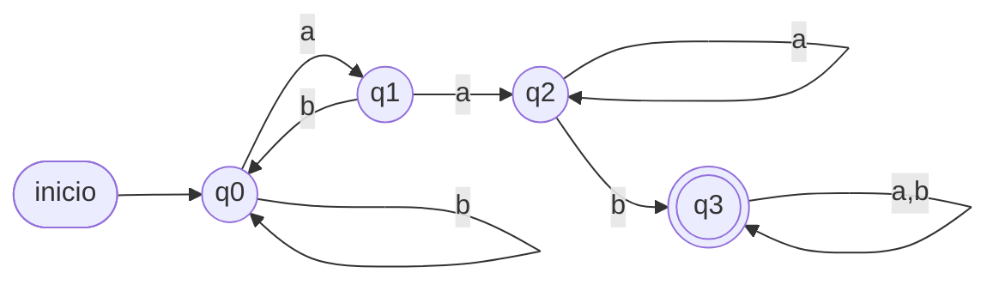
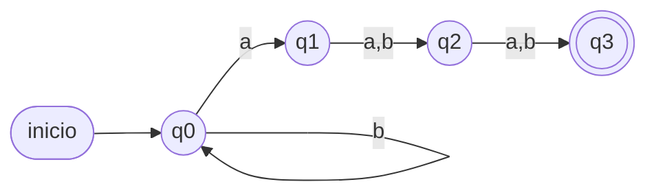
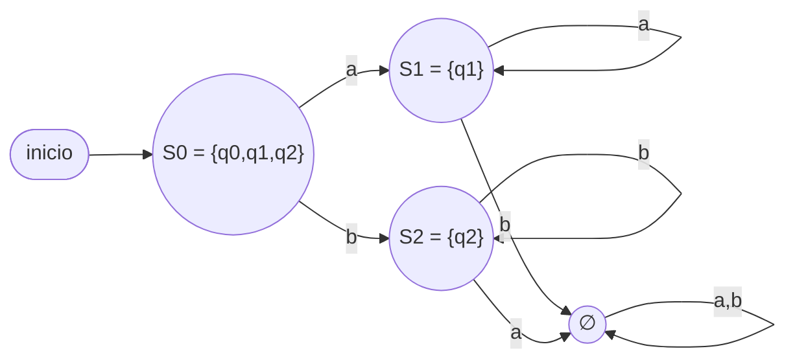

# Solucionario — Prueba Sumativa 3

Puntaje total: **60 pts**. Contenidos: AFD, AFND, AFND-ε, Autómata de Pila,
MT (1 cinta), MT (multicinta) — un tema por pregunta, en orden.

---

## Pregunta 1 — AFD (10 pts)

**a) (7 pts)** `L = {ω ∈ {a,b}* / ω contiene "aab"}`. `Q = {q0,q1,q2,q3}`, `q0`
inicial, `F = {q3}` (absorbente):

| δ | a | b |
|---|---|---|
| → q0 | q1 | q0 |
| q1 | q2 | q0 |
| q2 | q2 | q3 |
| * q3 | q3 | q3 |

q0 = sin progreso hacia "aab"; q1 = vi `a`; q2 = vi `aa`; q3 = ya vi `aab`.



Verif. `aab`: q0→q1→q2→q3 ✓. `ab`: q0→q1→q0 ✗ (no contiene "aab"). `aaab`:
q0→q1→q2→q2→q3 ✓.

**b) (3 pts)** El AFD **ya es mínimo**: cada estado exige un "resto" distinto
para llegar a `q3` — `q0` necesita ver `aab` completo, `q1` necesita `ab`, `q2`
necesita solo `b`, y `q3` ya está aceptando (necesita `ε`). Como los cuatro
"restos mínimos" son distintos, ningún par de estados es equivalente ⇒ no hay
fusión posible.

---

## Pregunta 2 — AFND (10 pts)

**Entendiendo el enunciado.** `L = {ω / la 3ª letra desde el final es 'a'}`.
Si escribimos la palabra como `ω = x₁x₂…xₙ`, la condición es `x_{n−2} = a`.
Por ejemplo, en `aab` la tercera desde el final es la **primera** `a` (luego
vienen 2 letras más: `a` y `b`) ⇒ pertenece a `L`; en `baa` la tercera desde
el final es la `b` ⇒ no pertenece.

**¿Por qué conviene un AFND aquí?** El problema es que, mientras lee, el
autómata **no sabe cuándo va a terminar la palabra** — así que no puede saber
qué letra quedará "a 3 del final" hasta que ya sea tarde. Un AFD tendría que ir
recordando en todo momento las últimas 3 letras leídas (2³ = 8 estados). El
AFND lo resuelve de otra forma: deja que en cada `a` leída se abra una
**apuesta** — *"¿y si esta `a` es justo la que quedará a 3 del final?"*. Cada
apuesta es una "copia" del autómata que corre en paralelo; la palabra se acepta
si **al menos una** apuesta resulta ganadora al terminar la lectura.

**a) (7 pts)** Cada estado representa una etapa de esa apuesta:

| Estado | Significado de esa copia |
|---|---|
| `q0` | "Todavía no aposté" — sigue leyendo cualquier cosa (siempre hay una copia aquí) |
| `q1` | "Acabo de apostar: la `a` que leí sería la 3ª desde el final" |
| `q2` | "Ya pasó **1** letra desde mi apuesta" (mi `a` está, por ahora, a 2 del final) |
| `q3` (final) | "Ya pasaron **2** letras desde mi apuesta" — si la palabra termina aquí, ¡gané! |

`M = ({q0,q1,q2,q3}, {a,b}, δ, q0, {q3})` con:

```
δ(q0,a) = {q0,q1}    δ(q0,b) = {q0}     ← solo se apuesta al leer 'a' (apostar
                                           por una 'b' nunca podría ganar)
δ(q1,a) = {q2}       δ(q1,b) = {q2}     ← 1ª letra tras la apuesta: cualquiera sirve
δ(q2,a) = {q3}       δ(q2,b) = {q3}     ← 2ª letra tras la apuesta: cualquiera sirve
```

Nota que desde `q3` **no hay transiciones**: si después de llegar a `q3` la
palabra continúa, esa copia muere — significa que su `a` quedó a más de 3 del
final y la apuesta se pierde. Eso está bien: otra copia (la que esperó en `q0`)
puede haber apostado más tarde.



**b) (3 pts) Trazas (análisis de hilos).** Recuerda que cada conjunto `{…}` es
la lista de estados donde hay copias vivas en ese instante.

`aab` — la 3ª desde el final es la 1ª letra (`a`) ⇒ debe **aceptar**:
```
{q0} →a→ {q0,q1} →a→ {q0,q1,q2} →b→ {q0,q2,q3}
```
Paso a paso: con la 1ª `a` una copia apuesta (`q1`) y otra espera (`q0`); con
la 2ª `a` la apuesta original avanza a `q2` **y además** se abre una apuesta
nueva por esta segunda `a` (`q1`); con la `b` final la apuesta original llega a
`q3` (pasaron exactamente 2 letras desde su `a`) y la segunda avanza a `q2`.
La palabra termina y el conjunto final `{q0,q2,q3}` **contiene `q3`** — la
primera apuesta ganó ⇒ **ACEPTA** ✓.

`baa` — la 3ª desde el final es la `b` ⇒ debe **rechazar**:
```
{q0} →b→ {q0} →a→ {q0,q1} →a→ {q0,q1,q2}
```
Con la `b` nadie puede apostar (solo hay lazo en `q0`); las dos `a` siguientes
abren apuestas, pero a la primera solo le alcanzó para avanzar hasta `q2`
(pasó **1** letra desde su `a`, no 2) y a la segunda recién le tocó apostar
(`q1`). La palabra termina y `{q0,q1,q2}` **no contiene `q3`**: ninguna
apuesta alcanzó a confirmarse ⇒ **RECHAZA** ✓.

> Nota didáctica: este lenguaje necesitaría **8 estados** como AFD (por la
> construcción de subconjuntos, `2³` combinaciones de las últimas 3 letras),
> pero solo **4** como AFND — el ejemplo clásico de por qué, cuando el
> enunciado dice "en cierta posición pasa algo", conviene diseñar el AFND
> directamente.

---

## Pregunta 3 — AFND-ε (12 pts)

`δ(q0,ε)={q1,q2}`, `δ(q1,a)={q1}`, `δ(q2,b)={q2}`, `F={q1,q2}`.
(Es la versión "a partir de q0 se puede tomar la rama de puras `a` o la de
puras `b`", equivalente a `L = a* ∪ b*`.)

**a) (4 pts) ε-clausuras:**

```
εcl(q0) = {q0, q1, q2}     (q0 alcanza q1 y q2 por ε)
εcl(q1) = {q1}             (sin transiciones ε salientes)
εcl(q2) = {q2}
```

**b) (8 pts) Construcción de subconjuntos.** Estado inicial `S0 = εcl(q0) =
{q0,q1,q2}` (ya es final, pues contiene `q1` y `q2` ⇒ acepta `ε`):

- `S0 = {q0,q1,q2}`: con `a` → mueve `{q1}`, εcl → `{q1} = S1`.
  Con `b` → mueve `{q2}`, εcl → `{q2} = S2`.
- `S1 = {q1}` (final): con `a` → `{q1}`, εcl → `S1`. Con `b` → `∅` (trampa).
- `S2 = {q2}` (final): con `b` → `{q2}`, εcl → `S2`. Con `a` → `∅` (trampa).

| δ_D | a | b |
|---|---|---|
| → * S0 = {q0,q1,q2} | S1 | S2 |
| * S1 = {q1} | S1 | ∅ |
| * S2 = {q2} | ∅ | S2 |
| ∅ | ∅ | ∅ |



Verif. `aaa`: S0→S1→S1→S1 (final) ⇒ **ACEPTA** ✓. `ab`: S0→S1→∅ ⇒ **RECHAZA** ✓
(mezclar `a` y `b` no está permitido: o solo `a`'s o solo `b`'s).

---

## Pregunta 4 — Autómata de Pila (10 pts)

`L = {aⁿbᵐ / m ≥ n ≥ 0}`. `Γ = {X, Z}`, estados `q0` (apila `a`'s), `q1`
(desapila mientras compara), `q2` (consume `b`'s excedentes), `qf`.

**a) (6 pts) Tabla:**

```
(q0, a, Z) → (q0, XZ)        # push por cada 'a'
(q0, a, X) → (q0, XX)
(q0, b, X) → (q1, pop)       # primera 'b': empieza a comparar
(q0, b, Z) → (q2, Z)         # caso n=0: pasa directo a "b's extra"
(q0, ε, Z) → (qf, Z)         # caso n=m=0: acepta la palabra vacía
(q1, b, X) → (q1, pop)       # sigue comparando mientras haya X
(q1, b, Z) → (q2, Z)         # ya no quedan X: b's adicionales (m>n)
(q1, ε, Z) → (qf, Z)         # pila vacía exactamente al terminar: m=n
(q2, b, Z) → (q2, Z)         # consume b's extra
(q2, ε, Z) → (qf, Z)         # acepta (m>n)
```

**b) (2 pts) Criterio de aceptación:** se apila una `X` por cada `a`; cada `b`
desapila una `X` mientras queden. Si la entrada termina con la pila en `Z`
(sin `X` sobrantes) —ya sea porque se agotaron exactamente, o porque sobraron
`b`'s después de vaciarla— la palabra se acepta. Si terminan las `b` habiendo
`X` sin desapilar (sobraron `a`'s, `n > m`), la pila queda con `X` en el tope y
**no** hay transición de aceptación ⇒ rechazo.

**c) (2 pts) Trazas:**

`aabbb` (n=2, m=3): `a,a`⇒pila `XXZ`; `b`⇒pop→`XZ`(q1); `b`⇒pop→`Z`(q1); `b`⇒
`(q1,b,Z)→(q2,Z)`; fin de entrada en `q2` con `Z` ⇒ `(q2,ε,Z)→qf` ⇒ **ACEPTA** ✓.

`aab` (n=2, m=1): `a,a`⇒pila `XXZ`; `b`⇒pop→`XZ`(q1); fin de entrada en `q1` con
tope `X` (no `Z`) ⇒ no hay transición aplicable ⇒ **RECHAZA** ✓.

---

## Pregunta 5 — Máquina de Turing, 1 cinta (10 pts)

`L = {aⁿbⁿcⁿ / n ≥ 1}`. Alfabeto de cinta `{a,b,c,X,Y,Z,B}`.

**a) (6 pts) Estados y reglas** (estrategia de "marcar y barrer" repetido):

```
q0 (buscar una 'a' sin marcar, moviendo a la derecha):
   lee 'a' → escribe X, mueve D, va a q1
   lee 'X' → mueve D, se queda en q0 (salta a's ya marcadas)
   lee 'Y' → mueve D, va a q4 (ya no quedan a's: pasar a verificación final)

q1 (buscar una 'b' sin marcar):
   lee 'a' o 'Y' → mueve D, se queda en q1 (salta lo ya visto)
   lee 'b' → escribe Y, mueve D, va a q2
   (si encuentra 'c' o B antes de una 'b' → RECHAZAR, faltan b's)

q2 (buscar una 'c' sin marcar):
   lee 'b' o 'Z' → mueve D, se queda en q2
   lee 'c' → escribe Z, mueve I, va a q3
   (si encuentra B antes de una 'c' → RECHAZAR, faltan c's)

q3 (volver al extremo izquierdo):
   lee 'X','Y','Z','a','b','c' → mueve I, se queda en q3
   lee B (extremo) → mueve D, vuelve a q0  (retoma la búsqueda de la próxima 'a')

q4 (verificación final: ya no quedan a's sin marcar):
   lee 'Y' o 'Z' → mueve D, se queda en q4 (salta lo ya emparejado)
   lee B → ACEPTAR (qf)
   lee 'b' o 'c' (sin marcar) → RECHAZAR (sobran b's o c's: n distinto)
```

**b) (2 pts)** Un autómata de pila (Pregunta 4) solo dispone de **una pila**,
que permite comparar **dos** cantidades a la vez (apilar con un símbolo,
desapilar con otro). Para verificar `n_a = n_b = n_c` hace falta comparar
**tres** cantidades simultáneamente, lo que excede lo que una sola pila puede
"recordar". La MT sí puede, porque su cinta se puede **recorrer de ida y
vuelta** cuantas veces sea necesario, marcando el progreso directamente sobre
la entrada.

**c) (2 pts)** `abc` (n=1): se marca la única `a`→X, la única `b`→Y, la única
`c`→Z; al volver a `q0` ya no hay `a` sin marcar (se lee `Y`) ⇒ `q4`; se
recorre `Y Z` y se llega al blanco sin `b` ni `c` sueltas ⇒ **ACEPTA**.
`aabc` (n_a=2, n_b=1, n_c=1): tras marcar la 1ª `a`,`b`,`c`, se vuelve y se
marca la 2ª `a`; en `q1` se busca una 2ª `b` sin marcar, pero solo quedan `Z`
(la `c` ya marcada) y el blanco — no hay transición definida para `Z` en `q1`
⇒ **RECHAZA** (sobra una `a` sin pareja).

---

## Pregunta 6 — Máquina de Turing, multicinta (8 pts)

`f(n,m) = n·m`, cinta 1 = entrada `|ⁿ*|ᵐ`, cinta 2 = resultado (vacía al inicio).

**a) (5 pts) Estrategia:**

```
Por cada una de las m marcas del bloque derecho (cinta 1):
    copiar las n marcas del bloque izquierdo (cinta 1) al final de la cinta 2
Al terminar de recorrer las m marcas, la cinta 2 contiene n · m marcas.
```

Se usan estados para: (1) recorrer y marcar —sin repetir— una `|` del bloque
`m` en la cinta 1, (2) recorrer las `n` marcas del bloque izquierdo en la
cinta 1 copiando cada una al final de la cinta 2 (avanzando ambos cabezales en
paralelo durante la copia), y (3) volver al inicio del bloque `n` y repetir
hasta agotar el bloque `m`. Al terminar, la cinta 2 tiene exactamente `n·m`
marcas.

**b) (3 pts)** Con **una sola cinta** habría que "tachar" con un símbolo
auxiliar cada marca del bloque `m` ya usada (para no volver a copiar el
bloque `n` de más), y además intercalar en la misma cinta tanto la
"contabilidad" de qué marca de `m` toca ahora como el resultado parcial que se
va acumulando — todo compitiendo por el mismo espacio. Con **dos cintas** cada
responsabilidad queda separada: la cinta 1 conserva intacta la entrada
original (solo se marcan temporalmente sus símbolos) y la cinta 2 acumula el
resultado sin interferir con la lectura de la entrada. Es el mismo motivo por
el que la rutina de "copiar" es más simple con un segundo cabezal dedicado.

---

## Tabla de especificaciones (para el docente)

| Preg. | Tema evaluado | Pts |
|---|---|---|
| 1 | AFD (diseño + argumento de minimalidad) | 10 |
| 2 | AFND (diseño directo + análisis de hilos) | 10 |
| 3 | AFND-ε (ε-clausura + subconjuntos) | 12 |
| 4 | Autómata de Pila | 10 |
| 5 | Máquina de Turing (1 cinta) | 10 |
| 6 | Máquina de Turing (multicinta) | 8 |
| | **Total** | **60** |
