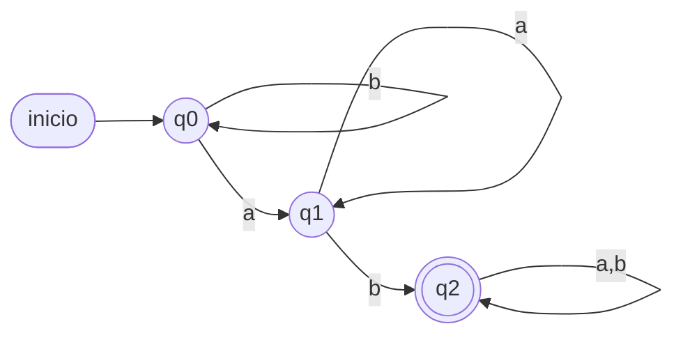
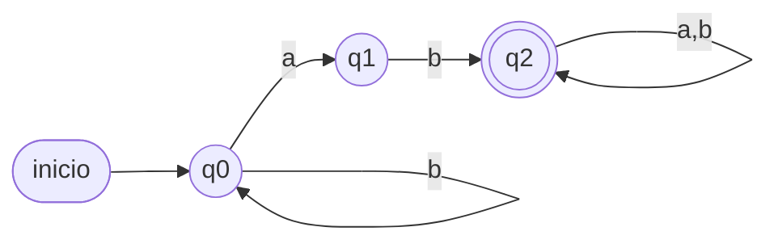
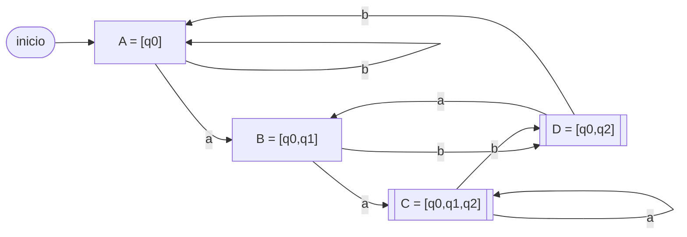
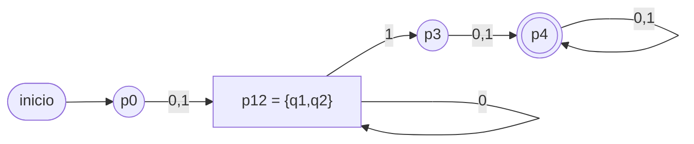
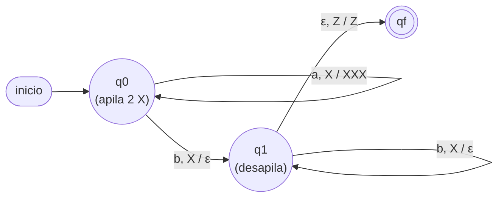

# Solucionario — Prueba Sumativa Unidad 3

Puntaje total: **60 pts**. Cada pregunta incluye la asignación de puntaje.

---

## Pregunta 1 (8 pts)

**a) (4 pts)** `G = ({0,1},{S,A},{S→0S|1A, A→0A|1A|ε}, S)`.

`S→0S` produce cero o más `0`; luego `S→1A` obliga a colocar **un `1`**; desde `A`
se genera cualquier cosa (`A→0A|1A|ε`). Por lo tanto toda palabra tiene **al menos
un `1`**:
```
L(G) = {ω ∈ {0,1}* / ω contiene al menos un 1}
```
Equivalente a `0*1(0+1)*`. *(2 pts derivación/estructura, 2 pts descripción.)*

**b) (4 pts)** GR para palabras que terminan en `b`:
```
S → aS | bS | b
```
`S→aS|bS` genera cualquier prefijo; `S→b` cierra con una `b` final.
*(Aceptar variantes correctas, p. ej. `S→aS|bA, A→aS|bA|... ` que garanticen b final.)*

---

## Pregunta 2 (10 pts)

Descomposición de las producciones no regulares:

| Producción | ¿Regular? | Reemplazo |
|---|---|---|
| `S → aaS` | no (dos term.) | `S → aX₁`, `X₁ → aS` |
| `S → bA` | **sí** | — |
| `S → ε` | **sí** | — |
| `A → abB` | no (dos term.) | `A → aY₁`, `Y₁ → bB` |
| `A → b` | **sí** | — |
| `B → ba` | no (dos term.) | `B → bZ₁`, `Z₁ → a` |
| `B → ε` | **sí** | — |

**GR equivalente:**
```
S  → aX₁ | bA | ε
X₁ → aS
A  → aY₁ | b
Y₁ → bB
B  → bZ₁ | ε
Z₁ → a
```
*(2 pts por identificar las regulares; 8 pts por descomponer correctamente cada
una de las tres producciones largas.)*

---

## Pregunta 3 (12 pts)

**a) (5 pts) AFD — contiene `ab`.** `Q={q0,q1,q2}`, `q0` inicial, `F={q2}`:

| δ | a | b |
|---|---|---|
| → q0 | q1 | q0 |
| q1 | q1 | q2 |
| * q2 | q2 | q2 |

q0 = sin `a` pendiente; q1 = última `a` (esperando `b`); q2 = ya vi `ab` (absorbe).



**b) (5 pts) AFND — contiene `ab`.** `F={q2}`:
```
δ(q0,a) = {q0,q1}   δ(q0,b) = {q0}
δ(q1,b) = {q2}      δ(q1,a) = ∅
δ(q2,a) = {q2}      δ(q2,b) = {q2}
```

| δ | a | b |
|---|---|---|
| → q0 | {q0,q1} | {q0} |
| q1 | ∅ | {q2} |
| * q2 | {q2} | {q2} |



**c) (2 pts) Trazas (AFND):**
`bab`: `{q0}→b→{q0}→a→{q0,q1}→b→{q0,q2}` ⇒ contiene q2 ⇒ **ACEPTA** ✓.
`ba`:  `{q0}→b→{q0}→a→{q0,q1}` ⇒ sin q2 ⇒ **RECHAZA** ✓.

---

## Pregunta 4 (14 pts)

**a) (8 pts) Subconjuntos.** Desde `[q0]`:

- `A=[q0]`: a→`{q0,q1}`, b→`{q0}`
- `B=[q0,q1]`: a→`{q0,q1}∪{q2}={q0,q1,q2}`, b→`{q0}∪{q2}={q0,q2}`
- `C=[q0,q1,q2]`: a→`{q0,q1,q2}`, b→`{q0,q2}`
- `D=[q0,q2]`: a→`{q0,q1}`, b→`{q0}`

| δ_D | a | b |
|---|---|---|
| → A = [q0] | B | A |
| B = [q0,q1] | C | D |
| * C = [q0,q1,q2] | C | D |
| * D = [q0,q2] | B | A |

Finales `{C, D}` (contienen q2). Todos alcanzables desde A ⇒ ninguno inalcanzable.



**b) (6 pts) Minimización.** `F={q4}`.

`Π₀ = { q0 q1 q2 q3 | q4 }`

- Grupo `{q0,q1,q2,q3}`:
  `q3` con `0` y `1` va a `q4` (final) ⇒ **q3 se separa**.
  `q0,q1,q2` con `0,1` van a estados no finales ⇒ quedan juntos por ahora.
  `Π₁ = { q0 q1 q2 | q3 | q4 }`
- Refinando `{q0,q1,q2}` con `Π₁` (sea G1=`{q0,q1,q2}`, G2=`{q3}`):
  `q0`: 0→q1(G1), 1→q2(G1)
  `q1`: 0→q1(G1), 1→q3(G2)
  `q2`: 0→q2(G1), 1→q3(G2)
  Con `1`, `q0`→G1 pero `q1,q2`→G2 ⇒ **q0 se separa**; `q1,q2` siguen juntos.
  `Π₂ = { q0 | q1 q2 | q3 | q4 }`
- Refinando `{q1,q2}`: ambos 0→G(`{q1,q2}`), 1→`{q3}` ⇒ **no se separan**.
  `Π₃ = Π₂` (estable).

**AFD mínimo:** `p0=q0`, `p12={q1,q2}`, `p3=q3`, `p4=q4`, `F={p4}` (5 → 4 estados):

| δ | 0 | 1 |
|---|---|---|
| → p0 | p12 | p12 |
| p12 | p12 | p3 |
| p3 | p4 | p4 |
| * p4 | p4 | p4 |



*(a: 8 pts — construcción completa y finales correctos. b: 6 pts — 2 por Π₀,
2 por el refinamiento, 2 por el AFD mínimo con la fusión `q1≡q2`.)*

---

## Pregunta 5 (8 pts)

`L = {aⁿb²ⁿ / n > 0}`. Estrategia: apilar **dos** `X` por cada `a` (quedan `2n`),
y desapilar **una** `X` por cada `b` (se requieren `2n` b's). `Γ = {X, Z}`:

```
q0, a, Z → (q0, XXZ)     q0, a, X → (q0, XXX)     # cada 'a' apila 2 X
q0, b, X → (q1, pop)                               # primera 'b': empieza a desapilar
q1, b, X → (q1, pop)                               # cada 'b' desapila 1 X
q1, ε, Z → (qf, Z)                                 # pila vacía ⇒ aceptar
```

En tabla:

| Γ \ input | a | b |
|---|---|---|
| **Z** | q0 \ push(XX) | q_fail |
| **X** | q0 \ push(XX) [en q0] · q1 \ pop() [primera b] | q1 \ pop() |

**Criterio de aceptación:** al terminar la entrada la pila queda vacía (solo `Z`),
lo que ocurre exactamente cuando el número de `b` es el doble del de `a`.
Aristas leídas como `entrada, tope / reemplazo`:



**Traza `abb`** (n=1): `a` ⇒ pila `XXZ`; `b` ⇒ `pop` → `XZ` (paso a q1);
`b` ⇒ `pop` → `Z`; entrada terminada con pila vacía ⇒ **ACEPTA** ✓.

*(4 pts diseño push/pop, 2 pts criterio de aceptación, 2 pts traza.)*

---

## Pregunta 6 (4 pts)

**a) (2 pts)** `L((0+1)*00(0+1)*)` = palabras sobre `{0,1}` que **contienen la
subcadena `00`**: `{ω ∈ {0,1}* / ω contiene 00}`.

**b) (2 pts)** "Al menos una `a` y al menos una `b`" (aparecen en cualquier orden):
```
(a+b)* a (a+b)* b (a+b)*   +   (a+b)* b (a+b)* a (a+b)*
```
*(Aceptar cualquier RegEx equivalente correcta.)*

---

## Pregunta 7 (4 pts)

MT para el **sucesor** `f(n) = n + 1` en unario. Entrada `|ⁿ`:

```
q0: mover a la derecha sobre '|'; al leer B (blanco), escribir '|' → q1 (HALT)
```
Es decir, se avanza hasta el final del bloque de marcas y se **escribe una marca
adicional** sobre el primer blanco. Resultado: `|ⁿ⁺¹`.

Ejemplo: `|||` (3) → se avanza a la derecha, en el blanco se escribe `|` → `||||`
(4). ✓

*(2 pts recorrido a la derecha, 2 pts escribir la marca en el blanco y detenerse.)*

---

## Tabla de especificaciones (para el docente)

| Preg. | Tipo evaluado | Módulo | Pts |
|---|---|---|---|
| 1 | Gramáticas / GR | 1 | 8 |
| 2 | GRE → GR | 1 | 10 |
| 3 | AFD vs AFND | 2 | 12 |
| 4 | Subconjuntos + minimización | 2 | 14 |
| 5 | Autómata apilador | 3 | 8 |
| 6 | Expresiones regulares | 4 | 4 |
| 7 | Máquina de Turing | 3 | 4 |
| | | **Total** | **60** |
